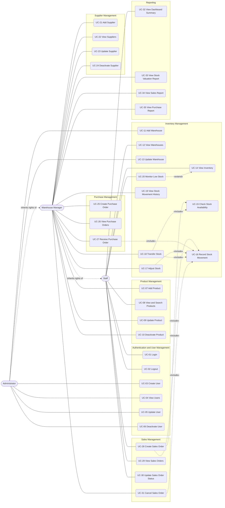
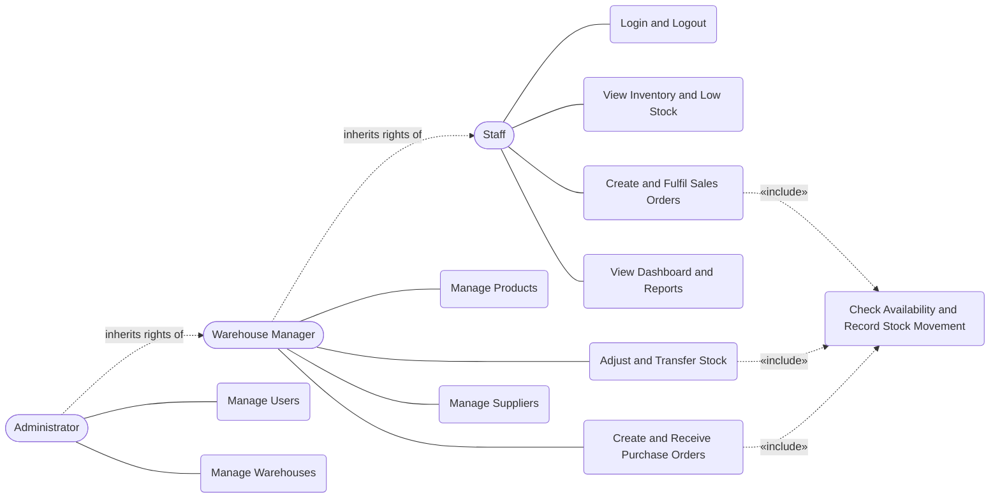

# Retail Inventory Management System
# Use Case Specification

| | |
|---|---|
| **Document** | `docs/use-cases.md` |
| **Version** | 1.0 |
| **Date** | 28 September 2026 |
| **Project** | Retail Inventory Management System (Agile Capstone) |
| **Technology** | React (frontend), Node.js + Express (backend API), MySQL (database) |

---

## 1. Introduction

### 1.1 Purpose
This document specifies the functional behaviour of the Retail Inventory Management System (RIMS) as a set of use cases. It is written for developers (API, database and UI design), for testers (acceptance scenarios) and for the project report (UML use case diagram and traceability).

### 1.2 How to read the status of a use case
The project is being built under a four-day delivery constraint, so scope is deliberately limited. No functional module is claimed as already implemented; the status column describes **planned scope**.

| Status | Meaning |
|---|---|
| **Core** | Committed to the minimum viable product (MVP). Required for the end-to-end flow: Supplier → Purchase → Stock in → Sale → Stock out → Dashboard. |
| **Optional** | Valuable and low-risk, built only if time remains after all Core use cases work. |
| **Proposed** | Standard for a retail inventory system but outside the current scope. Listed as future work (Section 15). |

Priority (High / Medium / Low) states how important the use case is to the working system.

### 1.3 Terminology
The following terms are used consistently throughout the document.

| Term | Meaning |
|---|---|
| **Product** | A sellable item identified by a unique SKU. |
| **Warehouse** | A physical stock location. The system supports several warehouses. |
| **Stock level** | The quantity of one product held in one warehouse. |
| **Stock movement** | An immutable record of one change to a stock level (receipt, sale, adjustment, transfer, cancellation). |
| **Purchase order (PO)** | An order placed with a supplier to acquire products into a warehouse. |
| **Sales order (SO)** | An order for products, fulfilled from one warehouse. |
| **Deactivate** | Mark a record inactive (soft delete). The record is kept for history but cannot be used in new transactions. |
| **Reorder level** | The stock quantity at or below which a product in a warehouse is considered low stock. |

---

## 2. System Scope

### 2.1 In scope (MVP)
- Authentication and role-based access (three roles)
- User management (by the Administrator)
- Product catalogue (SKU, prices, reorder level)
- Warehouse management and per-warehouse stock levels
- Stock adjustment, stock transfer between warehouses, stock movement history
- Low-stock monitoring
- Supplier management, purchase orders and goods receipt
- Sales orders with stock validation and a simple fulfilment status flow
- Dashboard summary
- Optional reports (stock valuation, sales, purchases)

### 2.2 Out of scope (see Section 15)
Customer accounts and customer self-service ordering, product categories as managed records, invoices and payments, returns handling beyond order cancellation, approval workflows, e-mail notifications, barcode scanning, bulk import and multi-currency support.

### 2.3 System boundary
Everything inside the web application (frontend, API and database) is inside the boundary. Customers and suppliers are **external parties** whose information is recorded by staff; they do not log in to the system in the MVP.

---

## 3. Actors

| Actor | Type | Description | Role value (proposed) |
|---|---|---|---|
| **Administrator** | Primary, human | Owns the system: manages users, warehouses and everything the Warehouse Manager can do. | `admin` |
| **Warehouse Manager** (Inventory Manager) | Primary, human | Runs day-to-day inventory: catalogue, stock corrections, transfers, suppliers, purchases, reports. Also performs everything Staff can do. | `manager` |
| **Staff** (Sales / Fulfilment Staff) | Primary, human | Looks up products and stock, creates and fulfils sales orders. | `staff` |
| **Customer** | External party | Buys products. In the MVP only a customer name is recorded on a sales order. Not a system actor. | none |
| **Supplier** | External party | Provides stock. Managed as a business record; does not log in. Not a system actor. | none |

### 3.1 Actor generalization
Rights are cumulative: **Administrator** inherits all rights of **Warehouse Manager**, which inherits all rights of **Staff**. In each use case the *Primary Actor* is the lowest role permitted to perform it; every higher role can perform it too.

---

## 4. Actor Responsibilities

### 4.1 Responsibilities
- **Staff**: search products, check stock, monitor low stock, create sales orders, move orders through Packed and Shipped, view the dashboard.
- **Warehouse Manager**: maintain products, adjust stock with a reason, transfer stock between warehouses, review movement history, maintain suppliers, create and receive purchase orders, cancel sales orders, view reports and stock value.
- **Administrator**: create and maintain user accounts and roles, maintain warehouses, and oversee all data.

### 4.2 Permission matrix

| Function | Staff | Manager | Admin |
|---|:-:|:-:|:-:|
| Login / Logout | ✔ | ✔ | ✔ |
| Manage users | | | ✔ |
| View products | ✔ | ✔ | ✔ |
| Add / update / deactivate products | | ✔ | ✔ |
| View warehouses | ✔ | ✔ | ✔ |
| Add / update warehouses | | | ✔ |
| View inventory, check availability, monitor low stock | ✔ | ✔ | ✔ |
| Adjust stock, transfer stock | | ✔ | ✔ |
| View stock movement history | | ✔ | ✔ |
| Manage suppliers | | ✔ | ✔ |
| Create, view, receive purchase orders | | ✔ | ✔ |
| Create, view sales orders, update fulfilment status | ✔ | ✔ | ✔ |
| Cancel sales orders | | ✔ | ✔ |
| View dashboard (stock value hidden from Staff) | ✔ | ✔ | ✔ |
| View reports | | ✔ | ✔ |

---

## 5. Use Case Overview

| Module | Use cases | Count |
|---|---|:-:|
| 7.1 Authentication and User Management | UC-01 to UC-06 | 6 |
| 7.2 Product Management | UC-07 to UC-10 | 4 |
| 7.3 Inventory Management (incl. warehouses) | UC-11 to UC-20 | 10 |
| 7.4 Supplier Management | UC-21 to UC-24 | 4 |
| 7.5 Purchase Management | UC-25 to UC-27 | 3 |
| 7.6 Sales Management | UC-28 to UC-31 | 4 |
| 7.7 Customer Management | UC-P04, UC-P05 (Proposed) | 2 |
| 7.8 Reporting | UC-32 to UC-35 | 4 |

Two use cases are **internal** (performed by the system on behalf of an actor and reused by others): UC-15 Check Stock Availability and UC-16 Record Stock Movement.

---

## 6. Use Case Summary Table

| ID | Use Case | Primary Actor | Module | Priority | Status |
|---|---|---|---|---|---|
| UC-01 | Login | Staff (any role) | Authentication and User Mgmt | High | Core |
| UC-02 | Logout | Staff (any role) | Authentication and User Mgmt | Medium | Core |
| UC-03 | Create User | Administrator | Authentication and User Mgmt | High | Core |
| UC-04 | View Users | Administrator | Authentication and User Mgmt | Medium | Core |
| UC-05 | Update User | Administrator | Authentication and User Mgmt | Medium | Core |
| UC-06 | Deactivate User | Administrator | Authentication and User Mgmt | Medium | Core |
| UC-07 | Add Product | Warehouse Manager | Product Mgmt | High | Core |
| UC-08 | View and Search Products | Staff | Product Mgmt | High | Core |
| UC-09 | Update Product | Warehouse Manager | Product Mgmt | High | Core |
| UC-10 | Deactivate Product | Warehouse Manager | Product Mgmt | Medium | Core |
| UC-11 | Add Warehouse | Administrator | Inventory Mgmt | High | Core |
| UC-12 | View Warehouses | Staff | Inventory Mgmt | High | Core |
| UC-13 | Update Warehouse | Administrator | Inventory Mgmt | Medium | Core |
| UC-14 | View Inventory | Staff | Inventory Mgmt | High | Core |
| UC-15 | Check Stock Availability (internal) | Staff / System | Inventory Mgmt | High | Core |
| UC-16 | Record Stock Movement (internal) | System | Inventory Mgmt | High | Core |
| UC-17 | Adjust Stock | Warehouse Manager | Inventory Mgmt | High | Core |
| UC-18 | Transfer Stock | Warehouse Manager | Inventory Mgmt | High | Core |
| UC-19 | View Stock Movement History | Warehouse Manager | Inventory Mgmt | High | Core |
| UC-20 | Monitor Low Stock | Staff | Inventory Mgmt | High | Core |
| UC-21 | Add Supplier | Warehouse Manager | Supplier Mgmt | High | Core |
| UC-22 | View Suppliers | Warehouse Manager | Supplier Mgmt | Medium | Core |
| UC-23 | Update Supplier | Warehouse Manager | Supplier Mgmt | Medium | Core |
| UC-24 | Deactivate Supplier | Warehouse Manager | Supplier Mgmt | Low | Core |
| UC-25 | Create Purchase Order | Warehouse Manager | Purchase Mgmt | High | Core |
| UC-26 | View Purchase Orders | Warehouse Manager | Purchase Mgmt | High | Core |
| UC-27 | Receive Purchase Order | Warehouse Manager | Purchase Mgmt | High | Core |
| UC-28 | Create Sales Order | Staff | Sales Mgmt | High | Core |
| UC-29 | View Sales Orders | Staff | Sales Mgmt | High | Core |
| UC-30 | Update Sales Order Status | Staff | Sales Mgmt | High | Core |
| UC-31 | Cancel Sales Order | Warehouse Manager | Sales Mgmt | Medium | Optional |
| UC-32 | View Dashboard Summary | Staff | Reporting | High | Core |
| UC-33 | View Stock Valuation Report | Warehouse Manager | Reporting | Low | Optional |
| UC-34 | View Sales Report | Warehouse Manager | Reporting | Low | Optional |
| UC-35 | View Purchase Report | Warehouse Manager | Reporting | Low | Optional |
| UC-P04 | Manage Customers | Staff | Customer Mgmt | Medium | Proposed |
| UC-P05 | View Customer Purchase History | Staff | Customer Mgmt | Low | Proposed |

Other proposed use cases (UC-P01 to UC-P03, UC-P06 to UC-P14) are listed in Section 15.

---

## 7. Detailed Use Cases

Conventions used in every specification below:
- "System" means the web application (frontend and API) as one unit.
- Every use case except UC-01 has the precondition **"The user is logged in with a role permitted for this use case"**, abbreviated as *Authorized session*. If the session is missing or expired the system rejects the request and asks the user to log in again; if the role is insufficient the system rejects the request as forbidden.
- Business rule identifiers (BR-xx) refer to Section 12.
- Names of tables and API routes are given in Sections 10 and 11.

---

## 7.1 Authentication and User Management

### UC-01 Login

| Field | Detail |
|---|---|
| **Module** | Authentication and User Management |
| **Primary Actor** | Staff, Warehouse Manager or Administrator |
| **Supporting Actors** | None |
| **Goal** | Gain authenticated access to the system with the rights of the user's role. |
| **Description** | The user proves identity with e-mail and password. The system issues a time-limited session token that identifies the user and role. |
| **Preconditions** | The user has an active account; the system is reachable. |
| **Trigger** | The user opens the application or requests a protected page without a valid session. |
| **Postconditions** | The user holds a valid session token; the protected pages for the user's role are available. Nothing is changed in the database. |
| **Business Rules** | Passwords are stored only as hashes and are never returned (BR-14). Only active users may log in (BR-07). Every other function requires a valid session (BR-01). Repeated login attempts are rate limited. |
| **Data Used** | User |
| **Related Use Cases** | UC-02; precondition of all other use cases |

**Main Success Flow**
1. The user opens the login page.
2. The user enters e-mail and password and submits.
3. The system checks that both fields are present.
4. The system finds the active user with that e-mail.
5. The system compares the password with the stored hash.
6. The system creates a session token containing the user identifier and role, with an expiry time.
7. The system returns the token and the user's basic profile (identifier, name, role).
8. The system shows the dashboard.

**Alternative Flows**
- A1: A valid token already exists; the system skips the form and shows the dashboard.
- A2: The token expires during use; the system redirects to the login page and, after login, returns the user to the dashboard.

**Exception Flows**
- E1: A field is empty or the e-mail is malformed; the system shows a validation message.
- E2: The e-mail is unknown or the password is wrong; the system shows the same generic message "Invalid email or password" for both cases.
- E3: The account is deactivated; the system refuses login and tells the user to contact the Administrator.
- E4: Too many attempts in a short period; the system temporarily refuses further attempts.
- E5: Database failure; the system shows a generic error and does not create a session.

---

### UC-02 Logout

| Field | Detail |
|---|---|
| **Module** | Authentication and User Management |
| **Primary Actor** | Staff, Warehouse Manager or Administrator |
| **Supporting Actors** | None |
| **Goal** | End the current session on this device. |
| **Description** | The frontend discards the session token and cached profile and returns to the login page. |
| **Preconditions** | Authorized session. |
| **Trigger** | The user selects Logout. |
| **Postconditions** | No session is held on the device; protected pages require login again. |
| **Business Rules** | The session token is stateless, so it remains technically valid until it expires (a token block-list is a proposed improvement). |
| **Data Used** | Session token (client-side) |
| **Related Use Cases** | UC-01 |

**Main Success Flow**
1. The user selects Logout.
2. The system removes the token and cached profile from the browser.
3. The system shows the login page.

**Alternative Flows**
- A1: The token expires; the system performs the same steps automatically.

**Exception Flows**
- E1: No token is found; the system still shows the login page.

---

### UC-03 Create User

| Field | Detail |
|---|---|
| **Module** | Authentication and User Management |
| **Primary Actor** | Administrator |
| **Supporting Actors** | None |
| **Goal** | Give a new person access to the system with a specific role. |
| **Description** | The Administrator enters the person's details and assigns a role. There is no public self-registration. |
| **Preconditions** | Authorized session as Administrator. |
| **Trigger** | The Administrator selects "Add User" on the Users page. |
| **Postconditions** | A new active user exists and can log in with the assigned role. |
| **Business Rules** | E-mail must be unique (BR-15). Role must be one of admin, manager, staff (BR-02). Password stored hashed (BR-14). |
| **Data Used** | User |
| **Related Use Cases** | UC-04, UC-05, UC-01 |

**Main Success Flow**
1. The Administrator opens the Users page and selects "Add User".
2. The system shows a form for name, e-mail, initial password and role.
3. The Administrator completes the form and submits.
4. The system validates required fields, e-mail format, minimum password length and role value.
5. The system checks that the e-mail is not already used.
6. The system hashes the password and stores the user as active.
7. The system confirms and refreshes the user list.

**Alternative Flows**
- A1: The Administrator cancels the form; nothing is saved.

**Exception Flows**
- E1: Validation fails; the system highlights the fields and saves nothing.
- E2: E-mail already exists; the system shows "Email already in use".
- E3: The caller is not an Administrator; the system rejects the request as forbidden.
- E4: Database failure; the system shows an error and saves nothing.

---

### UC-04 View Users

| Field | Detail |
|---|---|
| **Module** | Authentication and User Management |
| **Primary Actor** | Administrator |
| **Supporting Actors** | None |
| **Goal** | See who has access and with which role. |
| **Description** | The system lists users with name, e-mail, role and status. |
| **Preconditions** | Authorized session as Administrator. |
| **Trigger** | The Administrator opens the Users page. |
| **Postconditions** | None (read-only). |
| **Business Rules** | Password data is never included in the response (BR-14). |
| **Data Used** | User |
| **Related Use Cases** | UC-03, UC-05, UC-06 |

**Main Success Flow**
1. The Administrator opens the Users page.
2. The system retrieves users, paged.
3. The system displays name, e-mail, role and active/inactive status.

**Alternative Flows**
- A1: The Administrator searches by name or e-mail; the system shows matching users.
- A2: No user matches; the system shows an empty-state message.

**Exception Flows**
- E1: Not an Administrator; forbidden.
- E2: Database failure; the system shows an error.

---

### UC-05 Update User

| Field | Detail |
|---|---|
| **Module** | Authentication and User Management |
| **Primary Actor** | Administrator |
| **Supporting Actors** | None |
| **Goal** | Correct a user's details, change the role, or set a new password. |
| **Description** | The Administrator edits an existing user. This includes reactivating a deactivated user. |
| **Preconditions** | Authorized session as Administrator; the user exists. |
| **Trigger** | The Administrator selects Edit on a user row. |
| **Postconditions** | The user record reflects the changes; role changes apply at the user's next login. |
| **Business Rules** | Unique e-mail (BR-15). At least one active Administrator must always remain (BR-15). New password is hashed (BR-14). |
| **Data Used** | User |
| **Related Use Cases** | UC-03, UC-04, UC-06 |

**Main Success Flow**
1. The Administrator selects Edit on a user.
2. The system shows the current name, e-mail, role and status.
3. The Administrator changes one or more fields and submits.
4. The system validates the input and the e-mail uniqueness.
5. The system saves the changes and confirms.

**Alternative Flows**
- A1: The Administrator enters a new password; the system stores its hash.
- A2: The Administrator sets status back to active, reactivating the user.

**Exception Flows**
- E1: User not found.
- E2: E-mail already used by another user.
- E3: The change would remove the last active Administrator; the system refuses.
- E4: Validation or database failure; nothing is saved.

---

### UC-06 Deactivate User

| Field | Detail |
|---|---|
| **Module** | Authentication and User Management |
| **Primary Actor** | Administrator |
| **Supporting Actors** | None |
| **Goal** | Remove a person's access without losing the history they created. |
| **Description** | The user is marked inactive. Records that reference the user (movements, orders) are retained. |
| **Preconditions** | Authorized session as Administrator; the user exists and is active. |
| **Trigger** | The Administrator selects Deactivate on a user row. |
| **Postconditions** | The user can no longer log in; historical records still show the user's name. |
| **Business Rules** | Soft delete only (BR-07). An Administrator cannot deactivate their own account and the last active Administrator cannot be deactivated (BR-15). |
| **Data Used** | User |
| **Related Use Cases** | UC-04, UC-05, UC-01 |

**Main Success Flow**
1. The Administrator selects Deactivate on a user.
2. The system asks for confirmation.
3. The Administrator confirms.
4. The system marks the user inactive.
5. The system confirms and updates the list.

**Alternative Flows**
- A1: The Administrator declines the confirmation; nothing changes.

**Exception Flows**
- E1: The Administrator targets their own account; the system refuses.
- E2: The user is the last active Administrator; the system refuses.
- E3: User not found; database failure.

---

## 7.2 Product Management

### UC-07 Add Product

| Field | Detail |
|---|---|
| **Module** | Product Management |
| **Primary Actor** | Warehouse Manager |
| **Supporting Actors** | None |
| **Goal** | Register a new sellable product so it can be purchased, stocked and sold. |
| **Description** | The manager enters SKU, name, category text, cost price, selling price, reorder level and optional description. |
| **Preconditions** | Authorized session as Warehouse Manager or Administrator. |
| **Trigger** | The manager selects "Add Product" on the Products page. |
| **Postconditions** | An active product exists with no stock; stock levels are created when the first stock movement occurs. |
| **Business Rules** | SKU is unique (BR-04). Prices are non-negative decimals with two places (BR-05). Reorder level is a non-negative whole number (BR-16). |
| **Data Used** | Product |
| **Related Use Cases** | UC-08, UC-09, UC-10, UC-25, UC-28 |

**Main Success Flow**
1. The manager opens the Products page and selects "Add Product".
2. The system shows the product form.
3. The manager enters the details and submits.
4. The system validates required fields, price formats and reorder level.
5. The system checks that the SKU does not already exist.
6. The system saves the product as active.
7. The system confirms and shows the product in the list.

**Alternative Flows**
- A1: The optional description is omitted; the product is saved without it.
- A2: The manager cancels; nothing is saved.

**Exception Flows**
- E1: Duplicate SKU; the system shows "SKU already exists".
- E2: Invalid or negative price, or a missing required field; the system shows validation messages.
- E3: Insufficient role; forbidden.
- E4: Database failure; nothing is saved.

---

### UC-08 View and Search Products

| Field | Detail |
|---|---|
| **Module** | Product Management |
| **Primary Actor** | Staff |
| **Supporting Actors** | None |
| **Goal** | Find a product and see its details. |
| **Description** | The system lists active products and lets the user search and filter. |
| **Preconditions** | Authorized session. |
| **Trigger** | The user opens the Products page or types into the search box. |
| **Postconditions** | None (read-only). |
| **Business Rules** | Inactive products are hidden by default; only Warehouse Manager and Administrator may include them (BR-07). Cost price is shown only to Warehouse Manager and Administrator. |
| **Data Used** | Product |
| **Related Use Cases** | UC-07, UC-09, UC-14 |

**Main Success Flow**
1. The user opens the Products page.
2. The system retrieves active products, paged.
3. The system shows SKU, name, category, selling price and reorder level.
4. The user enters search text.
5. The system returns products whose SKU or name matches.
6. The user selects a product to see its full details.

**Alternative Flows**
- A1: The user filters by category text.
- A2: A Warehouse Manager includes inactive products in the list.

**Exception Flows**
- E1: No match; the system shows an empty-state message.
- E2: Database failure; the system shows an error.

---

### UC-09 Update Product

| Field | Detail |
|---|---|
| **Module** | Product Management |
| **Primary Actor** | Warehouse Manager |
| **Supporting Actors** | None |
| **Goal** | Correct or change product information. |
| **Description** | The manager edits name, category, prices, reorder level or description. The SKU cannot be changed after creation. |
| **Preconditions** | Authorized session as Warehouse Manager or Administrator; the product exists and is active. |
| **Trigger** | The manager selects Edit on a product. |
| **Postconditions** | The product shows the new values. Existing orders keep the prices that were recorded on their lines. |
| **Business Rules** | SKU is immutable (BR-04). Price rules (BR-05). Price changes never alter historical order lines. |
| **Data Used** | Product |
| **Related Use Cases** | UC-07, UC-08, UC-10 |

**Main Success Flow**
1. The manager selects Edit on a product.
2. The system shows the current values with the SKU read-only.
3. The manager changes fields and submits.
4. The system validates the input.
5. The system saves and confirms.

**Alternative Flows**
- A1: The manager reactivates an inactive product by setting it active.

**Exception Flows**
- E1: Product not found.
- E2: Validation failure.
- E3: Insufficient role; database failure.

---

### UC-10 Deactivate Product

| Field | Detail |
|---|---|
| **Module** | Product Management |
| **Primary Actor** | Warehouse Manager |
| **Supporting Actors** | None |
| **Goal** | Stop a product from being ordered or sold while keeping its history. |
| **Description** | The product is marked inactive and excluded from new purchase and sales orders. |
| **Preconditions** | Authorized session as Warehouse Manager or Administrator; the product exists and is active. |
| **Trigger** | The manager selects Deactivate on a product. |
| **Postconditions** | The product is inactive; its stock levels and movement history remain visible. |
| **Business Rules** | Soft delete only (BR-07). Inactive products cannot be added to new POs or SOs (BR-07). |
| **Data Used** | Product, Stock Level |
| **Related Use Cases** | UC-08, UC-09, UC-25, UC-28 |

**Main Success Flow**
1. The manager selects Deactivate on a product.
2. The system asks for confirmation.
3. The manager confirms.
4. The system marks the product inactive.
5. The system confirms.

**Alternative Flows**
- A1: The product still has stock; the system shows the remaining quantity in the confirmation message, and the manager may proceed.

**Exception Flows**
- E1: Product not found or already inactive.
- E2: Insufficient role; database failure.

---

## 7.3 Inventory Management

### UC-11 Add Warehouse

| Field | Detail |
|---|---|
| **Module** | Inventory Management |
| **Primary Actor** | Administrator |
| **Supporting Actors** | None |
| **Goal** | Register a new stock location. |
| **Description** | The Administrator enters a warehouse code, name and location. |
| **Preconditions** | Authorized session as Administrator. |
| **Trigger** | The Administrator selects "Add Warehouse". |
| **Postconditions** | An active warehouse exists and can hold stock. |
| **Business Rules** | Warehouse code and name are unique. |
| **Data Used** | Warehouse |
| **Related Use Cases** | UC-12, UC-13 |

**Main Success Flow**
1. The Administrator opens the Warehouses page and selects "Add Warehouse".
2. The system shows the form.
3. The Administrator enters code, name and location and submits.
4. The system validates the input and uniqueness.
5. The system saves the warehouse as active and confirms.

**Alternative Flows**
- A1: The location text is omitted; the warehouse is saved without it.

**Exception Flows**
- E1: Duplicate code or name.
- E2: Validation failure.
- E3: Insufficient role; database failure.

---

### UC-12 View Warehouses

| Field | Detail |
|---|---|
| **Module** | Inventory Management |
| **Primary Actor** | Staff |
| **Supporting Actors** | None |
| **Goal** | See the available warehouses. |
| **Description** | The system lists warehouses with code, name, location and status. |
| **Preconditions** | Authorized session. |
| **Trigger** | The user opens the Warehouses page or a warehouse selector. |
| **Postconditions** | None (read-only). |
| **Business Rules** | Inactive warehouses are not offered in selectors for new transactions (BR-07). |
| **Data Used** | Warehouse, Stock Level |
| **Related Use Cases** | UC-11, UC-13, UC-14 |

**Main Success Flow**
1. The user opens the Warehouses page.
2. The system retrieves warehouses.
3. The system displays code, name, location and status.

**Alternative Flows**
- A1: The user selects a warehouse; the system opens the inventory view filtered to that warehouse (UC-14).

**Exception Flows**
- E1: Database failure; the system shows an error.

---

### UC-13 Update Warehouse

| Field | Detail |
|---|---|
| **Module** | Inventory Management |
| **Primary Actor** | Administrator |
| **Supporting Actors** | None |
| **Goal** | Change warehouse details or retire a warehouse. |
| **Description** | The Administrator edits name or location, or sets the warehouse inactive. |
| **Preconditions** | Authorized session as Administrator; the warehouse exists. |
| **Trigger** | The Administrator selects Edit on a warehouse. |
| **Postconditions** | The warehouse shows the new values or is inactive. |
| **Business Rules** | A warehouse that still holds stock cannot be deactivated (BR-08). Soft delete only (BR-07). |
| **Data Used** | Warehouse, Stock Level |
| **Related Use Cases** | UC-11, UC-12 |

**Main Success Flow**
1. The Administrator selects Edit on a warehouse.
2. The system shows the current values.
3. The Administrator changes fields and submits.
4. The system validates and saves.
5. The system confirms.

**Alternative Flows**
- A1: The Administrator sets the warehouse inactive; the system first checks that all its stock levels are zero.

**Exception Flows**
- E1: Warehouse not found.
- E2: Deactivation requested while stock remains; the system refuses and shows the total quantity held.
- E3: Duplicate name or code; validation or database failure.

---

### UC-14 View Inventory

| Field | Detail |
|---|---|
| **Module** | Inventory Management |
| **Primary Actor** | Staff |
| **Supporting Actors** | None |
| **Goal** | See current stock for each product in each warehouse. |
| **Description** | The system shows stock levels, with filters by warehouse, product and low-stock status. |
| **Preconditions** | Authorized session. |
| **Trigger** | The user opens the Inventory page. |
| **Postconditions** | None (read-only). |
| **Business Rules** | Quantities shown are the committed stock levels; they can never be negative (BR-03). |
| **Data Used** | Stock Level, Product, Warehouse |
| **Related Use Cases** | UC-20 (extends), UC-17, UC-18, UC-19 |

**Main Success Flow**
1. The user opens the Inventory page.
2. The system retrieves stock levels with product and warehouse names, paged.
3. The system displays product, SKU, warehouse and quantity.

**Alternative Flows**
- A1: The user filters by warehouse or searches by product.
- A2: A stock level is at or below the product's reorder level; the system highlights it (UC-20).

**Exception Flows**
- E1: No stock records match the filters; empty-state message.
- E2: Database failure; error message.

---

### UC-15 Check Stock Availability (internal)

| Field | Detail |
|---|---|
| **Module** | Inventory Management |
| **Primary Actor** | Staff (through UC-28) or Warehouse Manager (through UC-18) |
| **Supporting Actors** | System |
| **Goal** | Confirm that a warehouse holds enough of a product for a requested quantity. |
| **Description** | Reusable check that reads the stock level and compares it with the requested quantity. When used inside a transaction, the stock row is locked so that concurrent requests cannot both use the same stock. |
| **Preconditions** | Authorized session; product and warehouse exist and are active. |
| **Trigger** | Included by UC-28 and UC-18; may also be called from the order form to show available quantity. |
| **Postconditions** | The caller receives "available" or "shortage" with the shortfall quantity. Nothing is changed. |
| **Business Rules** | Requested quantity must be a positive whole number (BR-17). Availability equals the stock level in the chosen warehouse (BR-03). |
| **Data Used** | Stock Level, Product, Warehouse |
| **Related Use Cases** | UC-28, UC-18 |

**Main Success Flow**
1. The caller supplies product, warehouse and requested quantity.
2. The system reads the stock level (locking it when inside a transaction).
3. The system compares stock with the requested quantity.
4. The system returns "available".

**Alternative Flows**
- A1: No stock level exists yet for the product in that warehouse; the system treats stock as zero.

**Exception Flows**
- E1: Stock is lower than requested; the system returns "shortage" with the missing quantity.
- E2: Product or warehouse not found or inactive.

---

### UC-16 Record Stock Movement (internal)

| Field | Detail |
|---|---|
| **Module** | Inventory Management |
| **Primary Actor** | System (on behalf of the acting user) |
| **Supporting Actors** | None |
| **Goal** | Change a stock level and keep a permanent record of the change. |
| **Description** | Applies a signed quantity change to one stock level and writes one stock movement record. Every function that changes stock uses it, so the movement history is always complete. |
| **Preconditions** | Called inside a database transaction started by the calling use case. |
| **Trigger** | Included by UC-17, UC-18, UC-27, UC-28 and UC-31. |
| **Postconditions** | The stock level is updated and a movement record exists with type, quantity change, product, warehouse, user, timestamp and reference. Both are committed or both are rolled back. |
| **Business Rules** | The resulting quantity must not be negative (BR-03). The stock change and movement record are written in the same transaction (BR-06). Movements are never edited or deleted (BR-06). |
| **Data Used** | Stock Level, Stock Movement |
| **Related Use Cases** | UC-17, UC-18, UC-27, UC-28, UC-31 |

Movement types used (proposed values): purchase receipt, sale, sale cancellation, adjustment, transfer out, transfer in.

**Main Success Flow**
1. The caller supplies product, warehouse, signed quantity change, movement type, reason or reference and acting user.
2. The system locks the stock level (creating it with quantity zero if it does not exist).
3. The system computes the new quantity.
4. The system verifies the new quantity is not negative.
5. The system saves the new quantity.
6. The system inserts the movement record.
7. The system returns control to the calling use case, which commits the transaction.

**Alternative Flows**
- A1: First movement for a product in a warehouse; the stock level is created in step 2.

**Exception Flows**
- E1: The new quantity would be negative; the system raises an error and the caller rolls back the whole transaction.
- E2: Database failure; the caller rolls back.

---

### UC-17 Adjust Stock

| Field | Detail |
|---|---|
| **Module** | Inventory Management |
| **Primary Actor** | Warehouse Manager |
| **Supporting Actors** | None |
| **Goal** | Correct a stock level after a physical count, damage, loss or found stock. |
| **Description** | The manager increases or decreases the stock of a product in one warehouse and must give a reason. |
| **Preconditions** | Authorized session as Warehouse Manager or Administrator; product and warehouse are active. |
| **Trigger** | The manager selects Adjust on the Inventory page. |
| **Postconditions** | The stock level is corrected and an adjustment movement with the reason is stored. |
| **Business Rules** | A reason is mandatory (BR-18). Resulting stock cannot be negative (BR-03). Quantity change must be a non-zero whole number. |
| **Data Used** | Stock Level, Stock Movement, Product, Warehouse |
| **Related Use Cases** | UC-16 (include), UC-14, UC-19 |

**Main Success Flow**
1. The manager selects a product and warehouse and chooses Adjust.
2. The system shows the current quantity.
3. The manager enters the quantity change (positive or negative) and a reason.
4. The system validates the input.
5. The system starts a transaction and performs UC-16 with type "adjustment".
6. The system commits and shows the new quantity.

**Alternative Flows**
- A1: The manager cancels; nothing changes.

**Exception Flows**
- E1: Reason missing or quantity change is zero; validation message.
- E2: A decrease would make stock negative; the system rejects the adjustment.
- E3: Product or warehouse inactive or not found.
- E4: Insufficient role; database failure (transaction rolled back).

---

### UC-18 Transfer Stock

| Field | Detail |
|---|---|
| **Module** | Inventory Management |
| **Primary Actor** | Warehouse Manager |
| **Supporting Actors** | None |
| **Goal** | Move stock of a product from one warehouse to another. |
| **Description** | The manager selects source warehouse, destination warehouse, product and quantity. The transfer is completed immediately as one atomic operation. |
| **Preconditions** | Authorized session as Warehouse Manager or Administrator; at least two active warehouses exist. |
| **Trigger** | The manager selects "Transfer Stock". |
| **Postconditions** | Source stock is reduced and destination stock is increased by the same quantity; two linked movements are stored. |
| **Business Rules** | Source and destination must differ, and quantity cannot exceed source stock (BR-09). Both changes succeed or neither does (BR-06). |
| **Data Used** | Stock Level, Stock Movement, Product, Warehouse |
| **Related Use Cases** | UC-15 (include), UC-16 (include), UC-14, UC-19 |

**Main Success Flow**
1. The manager opens the transfer form.
2. The manager selects source, destination, product and quantity and submits.
3. The system validates the input.
4. The system starts a transaction and performs UC-15 for the source warehouse.
5. The system performs UC-16 with type "transfer out" on the source.
6. The system performs UC-16 with type "transfer in" on the destination.
7. The system commits and confirms with the new quantities.

**Alternative Flows**
- A1: Destination has no stock level yet for the product; UC-16 creates it.

**Exception Flows**
- E1: Source equals destination; validation message.
- E2: Insufficient stock at the source; the system rejects the transfer and shows the available quantity.
- E3: A warehouse or product is inactive or not found.
- E4: Failure in either step; the whole transaction is rolled back and neither stock level changes.

---

### UC-19 View Stock Movement History

| Field | Detail |
|---|---|
| **Module** | Inventory Management |
| **Primary Actor** | Warehouse Manager |
| **Supporting Actors** | None |
| **Goal** | Trace every change to stock for audit and investigation. |
| **Description** | The system lists stock movements, newest first, with filters. |
| **Preconditions** | Authorized session as Warehouse Manager or Administrator. |
| **Trigger** | The manager opens the Movement History tab. |
| **Postconditions** | None (read-only). |
| **Business Rules** | Movement records are immutable (BR-06). |
| **Data Used** | Stock Movement, Product, Warehouse, User |
| **Related Use Cases** | UC-16, UC-17, UC-18, UC-27, UC-28 |

**Main Success Flow**
1. The manager opens the Movement History tab.
2. The system retrieves movements, newest first, paged.
3. The system shows date and time, product, warehouse, type, quantity change, reason or reference and the user who caused it.

**Alternative Flows**
- A1: The manager filters by product, warehouse, type or date range.

**Exception Flows**
- E1: No movements match; empty-state message.
- E2: Insufficient role; database failure.

---

### UC-20 Monitor Low Stock

| Field | Detail |
|---|---|
| **Module** | Inventory Management |
| **Primary Actor** | Staff |
| **Supporting Actors** | None |
| **Goal** | Identify products that need restocking before they run out. |
| **Description** | The system flags stock levels at or below the product's reorder level, in the inventory list and as a count on the dashboard. It extends View Inventory. No e-mail alerts are sent in the MVP. |
| **Preconditions** | Authorized session; products have a reorder level. |
| **Trigger** | The user views inventory or the dashboard and at least one stock level meets the low-stock condition. |
| **Postconditions** | None (read-only). |
| **Business Rules** | Low stock means stock level is at or below the reorder level (BR-16). Only active products are evaluated. |
| **Data Used** | Stock Level, Product, Warehouse |
| **Related Use Cases** | UC-14 (extended), UC-32, UC-25 |

**Main Success Flow**
1. The user opens the Inventory page (UC-14).
2. The system compares each stock level with the product's reorder level.
3. The system highlights low-stock rows and offers a "low stock only" filter.
4. The user applies the filter and sees only low-stock items.

**Alternative Flows**
- A1: A Warehouse Manager opens Create Purchase Order (UC-25) from a low-stock row (optional shortcut).

**Exception Flows**
- E1: No item is below its reorder level; the filter shows an empty state stating that stock is healthy.
- E2: Database failure; error message.

---

## 7.4 Supplier Management

### UC-21 Add Supplier

| Field | Detail |
|---|---|
| **Module** | Supplier Management |
| **Primary Actor** | Warehouse Manager |
| **Supporting Actors** | None |
| **Goal** | Record a business that supplies stock so purchase orders can be raised against it. |
| **Description** | The manager enters name, contact person, e-mail, phone and address. |
| **Preconditions** | Authorized session as Warehouse Manager or Administrator. |
| **Trigger** | The manager selects "Add Supplier". |
| **Postconditions** | An active supplier exists. |
| **Business Rules** | Supplier name is unique. E-mail format is validated when given. |
| **Data Used** | Supplier |
| **Related Use Cases** | UC-22, UC-23, UC-24, UC-25 |

**Main Success Flow**
1. The manager opens the Suppliers page and selects "Add Supplier".
2. The system shows the form.
3. The manager enters details and submits.
4. The system validates required fields and formats.
5. The system checks name uniqueness.
6. The system saves the supplier as active and confirms.

**Alternative Flows**
- A1: Optional contact fields are omitted.

**Exception Flows**
- E1: Duplicate supplier name.
- E2: Validation failure.
- E3: Insufficient role; database failure.

---

### UC-22 View Suppliers

| Field | Detail |
|---|---|
| **Module** | Supplier Management |
| **Primary Actor** | Warehouse Manager |
| **Supporting Actors** | None |
| **Goal** | Look up supplier details. |
| **Description** | The system lists suppliers with contact information and status. |
| **Preconditions** | Authorized session as Warehouse Manager or Administrator. |
| **Trigger** | The manager opens the Suppliers page. |
| **Postconditions** | None (read-only). |
| **Business Rules** | Inactive suppliers are hidden by default. |
| **Data Used** | Supplier |
| **Related Use Cases** | UC-21, UC-23, UC-24 |

**Main Success Flow**
1. The manager opens the Suppliers page.
2. The system retrieves suppliers, paged.
3. The system displays name, contact person, phone, e-mail and status.

**Alternative Flows**
- A1: The manager searches by name.
- A2: The manager includes inactive suppliers.

**Exception Flows**
- E1: No match; empty-state message.
- E2: Database failure.

---

### UC-23 Update Supplier

| Field | Detail |
|---|---|
| **Module** | Supplier Management |
| **Primary Actor** | Warehouse Manager |
| **Supporting Actors** | None |
| **Goal** | Keep supplier contact details correct. |
| **Description** | The manager edits an existing supplier, including reactivating it. |
| **Preconditions** | Authorized session as Warehouse Manager or Administrator; the supplier exists. |
| **Trigger** | The manager selects Edit on a supplier. |
| **Postconditions** | The supplier shows the new details. Existing purchase orders are unaffected. |
| **Business Rules** | Unique name; e-mail format. |
| **Data Used** | Supplier |
| **Related Use Cases** | UC-21, UC-22, UC-24 |

**Main Success Flow**
1. The manager selects Edit on a supplier.
2. The system shows the current details.
3. The manager changes fields and submits.
4. The system validates and saves.
5. The system confirms.

**Alternative Flows**
- A1: The manager sets the supplier active again.

**Exception Flows**
- E1: Supplier not found.
- E2: Duplicate name; validation failure.
- E3: Database failure.

---

### UC-24 Deactivate Supplier

| Field | Detail |
|---|---|
| **Module** | Supplier Management |
| **Primary Actor** | Warehouse Manager |
| **Supporting Actors** | None |
| **Goal** | Stop raising new purchase orders against a supplier. |
| **Description** | The supplier is marked inactive; past purchase orders remain visible. |
| **Preconditions** | Authorized session as Warehouse Manager or Administrator; the supplier is active. |
| **Trigger** | The manager selects Deactivate on a supplier. |
| **Postconditions** | The supplier is inactive and cannot be selected for new purchase orders. |
| **Business Rules** | Soft delete only (BR-07). A supplier with purchase orders still awaiting receipt cannot be deactivated (BR-07). |
| **Data Used** | Supplier, Purchase Order |
| **Related Use Cases** | UC-22, UC-23, UC-25 |

**Main Success Flow**
1. The manager selects Deactivate on a supplier.
2. The system checks that no purchase order for this supplier is awaiting receipt.
3. The system asks for confirmation.
4. The manager confirms.
5. The system marks the supplier inactive and confirms.

**Alternative Flows**
- A1: The manager declines confirmation; nothing changes.

**Exception Flows**
- E1: Open purchase orders exist; the system refuses and lists them.
- E2: Supplier not found; database failure.

---

## 7.5 Purchase Management

### UC-25 Create Purchase Order

| Field | Detail |
|---|---|
| **Module** | Purchase Management |
| **Primary Actor** | Warehouse Manager |
| **Supporting Actors** | Supplier (external, informed outside the system) |
| **Goal** | Order stock from a supplier for delivery into a chosen warehouse. |
| **Description** | The manager selects a supplier and receiving warehouse and lists products with quantities and unit costs. The order is saved with status "Ordered". Stock does not change until goods are received. |
| **Preconditions** | Authorized session as Warehouse Manager or Administrator; at least one active supplier, product and warehouse. |
| **Trigger** | The manager selects "Create Purchase Order" (or the optional shortcut from UC-20). |
| **Postconditions** | A purchase order with status Ordered and its line items exists; stock is unchanged. |
| **Business Rules** | At least one line; quantities are positive whole numbers (BR-17). Unit cost non-negative (BR-05). Supplier, products and warehouse must be active (BR-07). The order total is computed by the system. |
| **Data Used** | Purchase Order, PO Item, Supplier, Product, Warehouse |
| **Related Use Cases** | UC-26, UC-27, UC-20, UC-21 |

**Main Success Flow**
1. The manager opens the Purchase Orders page and selects "Create Purchase Order".
2. The system shows the form.
3. The manager selects the supplier and receiving warehouse.
4. The manager adds lines (product, quantity, unit cost defaulting to the product's cost price).
5. The manager submits.
6. The system validates supplier, warehouse, lines and quantities.
7. The system generates a PO number, computes the total, and saves the order and its lines with status Ordered.
8. The system confirms and shows the purchase order.

**Alternative Flows**
- A1: The manager edits the unit cost of a line before submitting.
- A2: The same product is added twice; the system merges the lines.
- A3: The optional expected delivery date and notes are omitted.

**Exception Flows**
- E1: No lines, or a quantity is zero or negative; validation message.
- E2: Supplier, warehouse or product is inactive; the system refuses that selection.
- E3: Insufficient role; database failure (nothing saved).

---

### UC-26 View Purchase Orders

| Field | Detail |
|---|---|
| **Module** | Purchase Management |
| **Primary Actor** | Warehouse Manager |
| **Supporting Actors** | None |
| **Goal** | Track what has been ordered and what has been received. |
| **Description** | The system lists purchase orders and shows the lines of a selected order. |
| **Preconditions** | Authorized session as Warehouse Manager or Administrator. |
| **Trigger** | The manager opens the Purchase Orders page. |
| **Postconditions** | None (read-only). |
| **Business Rules** | Purchase orders are never deleted. |
| **Data Used** | Purchase Order, PO Item, Supplier, Warehouse, Product |
| **Related Use Cases** | UC-25, UC-27, UC-35 |

**Main Success Flow**
1. The manager opens the Purchase Orders page.
2. The system retrieves orders, newest first, paged.
3. The system shows PO number, supplier, warehouse, date, total and status.
4. The manager selects an order.
5. The system shows its lines with product, quantity and unit cost.

**Alternative Flows**
- A1: The manager filters by status, supplier or date range.

**Exception Flows**
- E1: No orders match; empty-state message.
- E2: Order not found; database failure.

---

### UC-27 Receive Purchase Order

| Field | Detail |
|---|---|
| **Module** | Purchase Management |
| **Primary Actor** | Warehouse Manager |
| **Supporting Actors** | Supplier (external, delivers goods) |
| **Goal** | Confirm delivery and add the delivered stock to the warehouse. |
| **Description** | When goods arrive, the manager marks the purchase order as received. The system adds every line's quantity to the receiving warehouse and records the receipt. In the MVP a purchase order is received in full, in one step. |
| **Preconditions** | Authorized session as Warehouse Manager or Administrator; the purchase order exists with status Ordered. |
| **Trigger** | The manager selects "Receive" on an Ordered purchase order. |
| **Postconditions** | Stock in the receiving warehouse is increased for each line; a purchase-receipt movement exists per line; the order status is Received with date and receiving user. |
| **Business Rules** | An order can be received only once (BR-10). All lines are applied in one transaction (BR-06, BR-10). Receiving does not change the product's cost price. |
| **Data Used** | Purchase Order, PO Item, Stock Level, Stock Movement, Product, Warehouse, User |
| **Related Use Cases** | UC-16 (include), UC-25, UC-26; partial receipt is proposed (UC-P06) |

**Main Success Flow**
1. The manager opens an Ordered purchase order and selects "Receive".
2. The system shows the lines and the receiving warehouse and asks for confirmation.
3. The manager confirms.
4. The system starts a transaction and re-checks that the order is still Ordered.
5. For each line the system performs UC-16 with type "purchase receipt".
6. The system sets the order status to Received and stores the receipt date and user.
7. The system commits and confirms; stock levels now show the new quantities.

**Alternative Flows**
- A1: The delivered quantities differ from the order; in the MVP the manager records the difference afterwards with UC-17 (full partial-receipt support is UC-P06).

**Exception Flows**
- E1: The order is already Received; the system refuses to add stock a second time.
- E2: Order not found.
- E3: Failure on any line; the whole transaction is rolled back, the order stays Ordered and no stock changes.
- E4: Insufficient role.

---

## 7.6 Sales Management

### UC-28 Create Sales Order

| Field | Detail |
|---|---|
| **Module** | Sales Management |
| **Primary Actor** | Staff |
| **Supporting Actors** | Customer (external; only the name is recorded) |
| **Goal** | Record a sale and reserve the goods by removing them from stock. |
| **Description** | Staff enter the customer name, choose the fulfilling warehouse and add products and quantities. The system verifies availability for every line and, if all lines are available, creates the order with status "New" and reduces stock in the same transaction. |
| **Preconditions** | Authorized session; at least one active warehouse and active product with stock. |
| **Trigger** | Staff select "Create Sales Order". |
| **Postconditions** | A sales order with status New and its lines exists; stock in the chosen warehouse is reduced; a sale movement exists per line. |
| **Business Rules** | Order needs at least one line; quantities are positive whole numbers (BR-17). Every line must be fully available in the chosen warehouse or no order is created (BR-11). Line price defaults to the product's selling price and is stored on the line (BR-05). Stock and order are saved in one transaction (BR-06, BR-11). |
| **Data Used** | Sales Order, Order Item, Stock Level, Stock Movement, Product, Warehouse |
| **Related Use Cases** | UC-15 (include), UC-16 (include), UC-29, UC-30, UC-31 |

**Main Success Flow**
1. Staff open the Sales Orders page and select "Create Sales Order".
2. The system shows the form.
3. Staff enter the customer name and select the fulfilling warehouse.
4. Staff add lines (product and quantity); the system shows the unit price and the available stock for each line.
5. Staff submit the order.
6. The system validates the input.
7. The system starts a transaction and performs UC-15 for each line.
8. The system generates an order number, computes the total and saves the order and its lines with status New.
9. For each line the system performs UC-16 with type "sale".
10. The system commits and confirms with the order number.

**Alternative Flows**
- A1: Staff remove or change lines before submitting.
- A2: The same product is added twice; the system merges the lines.

**Exception Flows**
- E1: No lines, or a quantity is zero or negative; validation message.
- E2: A line exceeds available stock; the system creates no order and lists each short product with available quantity.
- E3: A product or the warehouse is inactive; the system refuses that selection.
- E4: Another user took the stock between the check and the save; the locked check fails and the system rejects the order as in E2.
- E5: Database failure; the transaction is rolled back and no stock changes.

---

### UC-29 View Sales Orders

| Field | Detail |
|---|---|
| **Module** | Sales Management |
| **Primary Actor** | Staff |
| **Supporting Actors** | None |
| **Goal** | See orders and where each one is in fulfilment. |
| **Description** | The system lists sales orders and shows the lines and status history of a selected order. |
| **Preconditions** | Authorized session. |
| **Trigger** | The user opens the Sales Orders page. |
| **Postconditions** | None (read-only). |
| **Business Rules** | Sales orders are never deleted. |
| **Data Used** | Sales Order, Order Item, Product, Warehouse, User |
| **Related Use Cases** | UC-28, UC-30, UC-31, UC-34 |

**Main Success Flow**
1. The user opens the Sales Orders page.
2. The system retrieves orders, newest first, paged.
3. The system shows order number, customer name, warehouse, date, total and status.
4. The user selects an order.
5. The system shows its lines and current status.

**Alternative Flows**
- A1: The user filters by status, date range or customer name text.

**Exception Flows**
- E1: No orders match; empty-state message.
- E2: Order not found; database failure.

---

### UC-30 Update Sales Order Status

| Field | Detail |
|---|---|
| **Module** | Sales Management |
| **Primary Actor** | Staff |
| **Supporting Actors** | None |
| **Goal** | Record fulfilment progress: packed, then shipped. |
| **Description** | Staff move an order forward through the allowed status sequence. |
| **Preconditions** | Authorized session; the order exists and is not in a final status. |
| **Trigger** | Staff select "Mark as Packed" or "Mark as Shipped" on an order. |
| **Postconditions** | The order has the new status with the time and user recorded. Stock is not changed by status updates. |
| **Business Rules** | Allowed transitions: New → Packed → Shipped. Shipped and Cancelled are final (BR-12). |
| **Data Used** | Sales Order, User |
| **Related Use Cases** | UC-28, UC-29, UC-31 |

**Main Success Flow**
1. Staff open an order.
2. The system shows the next allowed action.
3. Staff select the action.
4. The system verifies the transition is allowed.
5. The system saves the new status and confirms.

**Alternative Flows**
- A1: Staff select Cancel; this is UC-31 and requires a Warehouse Manager.

**Exception Flows**
- E1: The transition is not allowed (for example New → Shipped); the system refuses.
- E2: The order is already final.
- E3: Order not found; database failure.

---

### UC-31 Cancel Sales Order

| Field | Detail |
|---|---|
| **Module** | Sales Management |
| **Primary Actor** | Warehouse Manager |
| **Supporting Actors** | None |
| **Goal** | Withdraw an order that will not be fulfilled and return its goods to stock. |
| **Description** | The manager cancels an order that is New or Packed. The system restores each line's quantity to the order's warehouse. |
| **Preconditions** | Authorized session as Warehouse Manager or Administrator; the order status is New or Packed. |
| **Trigger** | The manager selects Cancel on an order. |
| **Postconditions** | The order status is Cancelled; stock is restored; a sale-cancellation movement exists per line. |
| **Business Rules** | Only New or Packed orders can be cancelled (BR-12). Quantities return to the original warehouse (BR-13). All changes in one transaction (BR-06). |
| **Data Used** | Sales Order, Order Item, Stock Level, Stock Movement |
| **Related Use Cases** | UC-16 (include), UC-28, UC-29, UC-30 |

**Main Success Flow**
1. The manager opens an order and selects Cancel.
2. The system asks for confirmation and an optional reason.
3. The manager confirms.
4. The system starts a transaction and re-checks the order status.
5. For each line the system performs UC-16 with type "sale cancellation".
6. The system sets the order status to Cancelled.
7. The system commits and confirms.

**Alternative Flows**
- A1: The manager declines; nothing changes.

**Exception Flows**
- E1: The order is Shipped or already Cancelled; the system refuses.
- E2: Order not found.
- E3: Failure in any step; the transaction is rolled back.

---

## 7.7 Customer Management

In the MVP there is **no customer record**: the customer's name is typed as free text on the sales order (UC-28). The use cases below describe the standard extension and are **Proposed**.

### UC-P04 Manage Customers (Proposed)

| Field | Detail |
|---|---|
| **Module** | Customer Management |
| **Primary Actor** | Staff |
| **Supporting Actors** | Customer (external) |
| **Goal** | Keep reusable customer records so sales orders can be linked to a customer. |
| **Description** | Staff add, view and update customers (name, phone, e-mail, address). Sales orders then reference a customer record instead of free text. |
| **Preconditions** | Authorized session. |
| **Trigger** | Staff open the Customers page or choose "New customer" while creating a sales order. |
| **Postconditions** | A customer record is created or updated. |
| **Business Rules** | Phone or e-mail should be unique per customer to prevent duplicates. Customers with orders are deactivated, not deleted (BR-07). |
| **Data Used** | Customer (new), Sales Order |
| **Related Use Cases** | UC-28, UC-P05 |

**Main Success Flow**
1. Staff open the Customers page and select "Add Customer".
2. The system shows the form.
3. Staff enter details and submit.
4. The system validates and checks for duplicates.
5. The system saves the customer and confirms.

**Alternative Flows**
- A1: Staff search and open an existing customer, then edit and save.
- A2: Staff add a customer inline from the sales order form.

**Exception Flows**
- E1: Duplicate phone or e-mail; the system offers the existing record.
- E2: Validation failure; database failure.

---

### UC-P05 View Customer Purchase History (Proposed)

| Field | Detail |
|---|---|
| **Module** | Customer Management |
| **Primary Actor** | Staff |
| **Supporting Actors** | None |
| **Goal** | See what a customer has bought. |
| **Description** | The system lists all sales orders of a selected customer with totals and statuses. |
| **Preconditions** | Authorized session; UC-P04 implemented and the customer exists. |
| **Trigger** | Staff open a customer's detail page. |
| **Postconditions** | None (read-only). |
| **Business Rules** | Cancelled orders are shown but excluded from the purchase total. |
| **Data Used** | Customer (new), Sales Order, Order Item |
| **Related Use Cases** | UC-P04, UC-29 |

**Main Success Flow**
1. Staff open a customer.
2. The system retrieves that customer's sales orders.
3. The system displays order number, date, total and status, and the lifetime total of non-cancelled orders.

**Alternative Flows**
- A1: Staff filter by date range.

**Exception Flows**
- E1: The customer has no orders; empty-state message.
- E2: Customer not found; database failure.

---

## 7.8 Reporting

### UC-32 View Dashboard Summary

| Field | Detail |
|---|---|
| **Module** | Reporting |
| **Primary Actor** | Staff |
| **Supporting Actors** | None |
| **Goal** | Get a quick overview of the business state after login. |
| **Description** | The system shows key figures: number of active products, total units in stock, low-stock item count, sales orders by status, purchase orders awaiting receipt, total stock value, and the most recent stock movements. Stock value is shown to Warehouse Manager and Administrator only. |
| **Preconditions** | Authorized session. |
| **Trigger** | The user logs in or opens the Dashboard page. |
| **Postconditions** | None (read-only). |
| **Business Rules** | Figures are computed from current data at request time. Stock value equals the sum over stock levels of quantity multiplied by the product's cost price. Cost-based figures are hidden from Staff. |
| **Data Used** | Product, Stock Level, Sales Order, Purchase Order, Stock Movement |
| **Related Use Cases** | UC-20, UC-14, UC-29, UC-26 |

**Main Success Flow**
1. The user opens the Dashboard.
2. The system computes the summary figures.
3. The system displays them as summary cards and a recent-activity list.

**Alternative Flows**
- A1: A Staff user sees the dashboard without stock value.
- A2 (optional): The dashboard shows a chart, such as orders per status.

**Exception Flows**
- E1: There is no data yet; the dashboard shows zeros.
- E2: Database failure; the system shows an error in place of the affected cards.

---

### UC-33 View Stock Valuation Report

| Field | Detail |
|---|---|
| **Module** | Reporting |
| **Primary Actor** | Warehouse Manager |
| **Supporting Actors** | None |
| **Goal** | Know the monetary value of stock per warehouse and in total. |
| **Description** | The system lists products with quantity, cost price and value, grouped by warehouse. |
| **Preconditions** | Authorized session as Warehouse Manager or Administrator. |
| **Trigger** | The manager opens Reports and selects Stock Valuation. |
| **Postconditions** | None (read-only). |
| **Business Rules** | Value equals quantity multiplied by cost price. |
| **Data Used** | Stock Level, Product, Warehouse |
| **Related Use Cases** | UC-14, UC-32 |

**Main Success Flow**
1. The manager opens Reports and selects Stock Valuation.
2. The system calculates value per product and warehouse.
3. The system displays the table with warehouse subtotals and a grand total.

**Alternative Flows**
- A1: The manager filters by warehouse.

**Exception Flows**
- E1: No stock; empty-state message.
- E2: Insufficient role; database failure.

---

### UC-34 View Sales Report

| Field | Detail |
|---|---|
| **Module** | Reporting |
| **Primary Actor** | Warehouse Manager |
| **Supporting Actors** | None |
| **Goal** | Understand sales over a period. |
| **Description** | The system summarises non-cancelled sales orders for a date range: order count, total value and best-selling products. |
| **Preconditions** | Authorized session as Warehouse Manager or Administrator. |
| **Trigger** | The manager opens Reports and selects Sales Report. |
| **Postconditions** | None (read-only). |
| **Business Rules** | Cancelled orders are excluded. |
| **Data Used** | Sales Order, Order Item, Product |
| **Related Use Cases** | UC-29, UC-32 |

**Main Success Flow**
1. The manager opens the Sales Report and selects a date range.
2. The system aggregates orders and lines in the range.
3. The system displays totals and a ranked product list.

**Alternative Flows**
- A1: The manager narrows the report to one warehouse.

**Exception Flows**
- E1: No sales in the range; empty-state message.
- E2: Invalid date range (end before start); validation message; database failure.

---

### UC-35 View Purchase Report

| Field | Detail |
|---|---|
| **Module** | Reporting |
| **Primary Actor** | Warehouse Manager |
| **Supporting Actors** | None |
| **Goal** | Understand purchasing activity by supplier over a period. |
| **Description** | The system summarises purchase orders for a date range: order count, total value by supplier and received vs. awaiting status. |
| **Preconditions** | Authorized session as Warehouse Manager or Administrator. |
| **Trigger** | The manager opens Reports and selects Purchase Report. |
| **Postconditions** | None (read-only). |
| **Business Rules** | Values use the unit costs recorded on the purchase order lines. |
| **Data Used** | Purchase Order, PO Item, Supplier |
| **Related Use Cases** | UC-26, UC-32 |

**Main Success Flow**
1. The manager opens the Purchase Report and selects a date range.
2. The system aggregates purchase orders in the range.
3. The system displays totals per supplier and counts by status.

**Alternative Flows**
- A1: The manager filters by supplier.

**Exception Flows**
- E1: No purchases in the range; empty-state message.
- E2: Invalid date range; database failure.

---

## 8. Use Case Relationships

### 8.1 Include relationships
An `<<include>>` means the base use case always performs the included one as a mandatory step. Included use cases exist because two or more use cases share the same behaviour.

| Base use case | Included use case | Reason |
|---|---|---|
| UC-28 Create Sales Order | UC-15 Check Stock Availability | A sale must never be accepted without confirming stock for every line. |
| UC-18 Transfer Stock | UC-15 Check Stock Availability | The source warehouse must hold the quantity being moved. |
| UC-28 Create Sales Order | UC-16 Record Stock Movement | A sale reduces stock and must leave a movement record. |
| UC-27 Receive Purchase Order | UC-16 Record Stock Movement | Receiving increases stock and must leave a movement record. |
| UC-17 Adjust Stock | UC-16 Record Stock Movement | Every adjustment must be traceable. |
| UC-18 Transfer Stock | UC-16 Record Stock Movement | Transfers create a paired out/in record. |
| UC-31 Cancel Sales Order | UC-16 Record Stock Movement | Restoring stock must leave a movement record. |

### 8.2 Extend relationships
An `<<extend>>` adds optional behaviour that occurs only when a condition is met.

| Extending use case | Base use case | Condition | Reason |
|---|---|---|---|
| UC-20 Monitor Low Stock | UC-14 View Inventory | A stock level is at or below the product's reorder level. | Low-stock highlighting is extra behaviour on top of the normal inventory list. |

### 8.3 Actor generalization
Administrator generalizes Warehouse Manager, which generalizes Staff (Section 3.1). This removes the need to draw every association for every role.

### 8.4 Relationships deliberately not modelled
- Login is a precondition of all other use cases, not an `<<include>>`; drawing it would clutter the diagram without adding information.
- Creating a purchase order from a low-stock item is an optional shortcut and is described in the flow of UC-20 rather than as a separate relationship.
- Status update and cancellation of sales orders are separate use cases with different actor rights and are not linked by extend.

---

## 9. UML Use Case Diagram

### 9.1 Full diagram
Dotted labelled arrows show `<<include>>` (arrow points from the base use case to the included one) and `<<extend>>` (arrow points from the extending use case to the base). Dashed arrows between actors show generalization. Actors are linked only to the use cases for which they are the lowest permitted role.

### 9.2 Simplified high-level diagram
Use this version in presentations where the full diagram is too dense.

---

## 10. Traceability Matrix

Routes come from the project's agreed API contract. Routes marked *(proposed)* are not yet in the contract. Table and page names are working names to be confirmed when `database/schema.sql` and the frontend are built.

| Actor | Use case | API / backend responsibility | Database entities | Frontend responsibility |
|---|---|---|---|---|
| Any role | UC-01 Login | `POST /api/auth/login` verify hash, issue token | users | Login page, AuthContext.login |
| Any role | UC-02 Logout | none (client-side) | none | AuthContext.logout, redirect |
| Administrator | UC-03 Create User | `POST /api/users` validate, hash, insert | users | Users page: add form |
| Administrator | UC-04 View Users | `GET /api/users` | users | Users page: list |
| Administrator | UC-05 Update User | `PUT /api/users/:id` | users | Users page: edit form |
| Administrator | UC-06 Deactivate User | `DELETE /api/users/:id` (implemented as soft delete) | users | Users page: deactivate action |
| Manager | UC-07 Add Product | `POST /api/products` | products | Products page: add form |
| Staff | UC-08 View and Search Products | `GET /api/products` (search and filter params *proposed*) | products | Products page: table, search |
| Manager | UC-09 Update Product | `PUT /api/products/:id` | products | Products page: edit form |
| Manager | UC-10 Deactivate Product | `DELETE /api/products/:id` (soft delete) | products, stock_levels | Products page: deactivate action |
| Administrator | UC-11 Add Warehouse | `POST /api/warehouses` | warehouses | Warehouses page: add form |
| Staff | UC-12 View Warehouses | `GET /api/warehouses` | warehouses | Warehouses page, selectors |
| Administrator | UC-13 Update Warehouse | `PUT /api/warehouses/:id`, `DELETE /api/warehouses/:id` (soft, blocked if stock) | warehouses, stock_levels | Warehouses page: edit |
| Staff | UC-14 View Inventory | `GET /api/inventory` | stock_levels, products, warehouses | Inventory page: stock table |
| Staff / System | UC-15 Check Stock Availability | internal service function (row lock inside transaction) | stock_levels | Available quantity shown on order and transfer forms |
| System | UC-16 Record Stock Movement | internal service function `withTransaction` | stock_levels, stock_movements | none (visible in UC-19) |
| Manager | UC-17 Adjust Stock | `POST /api/inventory/adjust` | stock_levels, stock_movements | Inventory page: adjust dialog |
| Manager | UC-18 Transfer Stock | `POST /api/inventory/transfer` | stock_levels, stock_movements | Inventory page: transfer dialog |
| Manager | UC-19 View Stock Movement History | `GET /api/inventory/movements` | stock_movements, products, warehouses, users | Inventory page: history tab |
| Staff | UC-20 Monitor Low Stock | `GET /api/inventory?lowStock=true` *(proposed)*, dashboard count | stock_levels, products | Highlighted rows, low-stock filter |
| Manager | UC-21 Add Supplier | `POST /api/suppliers` | suppliers | Suppliers page: add form |
| Manager | UC-22 View Suppliers | `GET /api/suppliers` | suppliers | Suppliers page: list |
| Manager | UC-23 Update Supplier | `PUT /api/suppliers/:id` | suppliers | Suppliers page: edit form |
| Manager | UC-24 Deactivate Supplier | `DELETE /api/suppliers/:id` (soft, blocked by open POs) | suppliers, purchase_orders | Suppliers page: deactivate |
| Manager | UC-25 Create Purchase Order | `POST /api/purchase-orders` | purchase_orders, po_items, suppliers, products | Purchase Orders page: create form |
| Manager | UC-26 View Purchase Orders | `GET /api/purchase-orders` | purchase_orders, po_items | Purchase Orders page: list, detail |
| Manager | UC-27 Receive Purchase Order | `POST /api/purchase-orders/:id/receive` (transaction) | purchase_orders, po_items, stock_levels, stock_movements | Purchase Orders page: Receive action |
| Staff | UC-28 Create Sales Order | `POST /api/sales-orders` (transaction) | sales_orders, order_items, stock_levels, stock_movements | Sales Orders page: create form |
| Staff | UC-29 View Sales Orders | `GET /api/sales-orders` | sales_orders, order_items | Sales Orders page: list, detail |
| Staff | UC-30 Update Sales Order Status | `PATCH /api/sales-orders/:id/status` | sales_orders | Sales Orders page: status buttons |
| Manager | UC-31 Cancel Sales Order | `PATCH /api/sales-orders/:id/status` with status Cancelled (transaction) | sales_orders, order_items, stock_levels, stock_movements | Sales Orders page: Cancel action |
| Staff | UC-32 View Dashboard Summary | `GET /api/dashboard/summary` | products, stock_levels, sales_orders, purchase_orders, stock_movements | Dashboard page |
| Manager | UC-33 View Stock Valuation Report | `GET /api/reports/stock-valuation` *(proposed)* | stock_levels, products, warehouses | Reports page |
| Manager | UC-34 View Sales Report | `GET /api/reports/sales` *(proposed)* | sales_orders, order_items | Reports page |
| Manager | UC-35 View Purchase Report | `GET /api/reports/purchases` *(proposed)* | purchase_orders, po_items | Reports page |

---

## 11. API and Database Alignment

The entity list below matches the nine-table plan for the MVP. Exact column names will be fixed in `database/schema.sql`; only attributes required by the use cases are mentioned here, and they are proposals until the schema exists.

### 11.1 Authentication and Users
- **Backend:** login with rate limiting, token issue and verification middleware, role middleware, user CRUD with soft delete, last-active-admin protection.
- **Entities:** `users` (proposed attributes: e-mail unique, password hash, role, active flag).

### 11.2 Products
- **Backend:** product CRUD with unique SKU, soft delete, search and filter, hide cost price from Staff.
- **Entities:** `products` (proposed attributes: SKU unique, cost price, selling price, reorder level, category text, active flag).

### 11.3 Warehouses and Inventory
- **Backend:** warehouse CRUD with soft delete blocked when stock exists; inventory listing; shared transaction helper; stock availability check with row lock; stock movement recorder; adjust and transfer services; movement history query; low-stock query.
- **Entities:** `warehouses`, `stock_levels` (unique per product and warehouse; quantity never below zero), `stock_movements` (append-only; type, signed quantity change, reason or reference, user, timestamp).

### 11.4 Suppliers
- **Backend:** supplier CRUD with soft delete blocked by open purchase orders.
- **Entities:** `suppliers`.

### 11.5 Purchases
- **Backend:** create purchase order with lines; receive purchase order as one transaction using the movement recorder; status guard so an order is received once.
- **Entities:** `purchase_orders` (status Ordered or Received), `po_items`.

### 11.6 Sales
- **Backend:** create sales order as one transaction (availability check, order and lines, stock reduction, movements); status transition guard; cancellation with stock restoration.
- **Entities:** `sales_orders` (status New, Packed, Shipped, Cancelled; customer name text), `order_items` (unit price stored at time of sale).

### 11.7 Dashboard and Reports
- **Backend:** aggregate queries for summary figures and optional reports; role-based hiding of cost figures.
- **Entities:** read-only use of all tables above.

---

## 12. Business Rules

| ID | Rule |
|---|---|
| BR-01 | Every API function except login requires a valid, unexpired session token. |
| BR-02 | Access is decided by role (admin, manager, staff) according to the permission matrix in Section 4.2; higher roles inherit lower roles' rights. |
| BR-03 | The quantity of a product in a warehouse can never become negative. |
| BR-04 | A product SKU is unique and cannot be changed after creation. |
| BR-05 | Prices and costs are stored as decimals with two places and cannot be negative. Order lines store the price used at the time of the transaction. |
| BR-06 | Every change to a stock level is written together with a stock movement record in the same database transaction. If any step fails, the whole operation is rolled back. Movement records are never edited or deleted. |
| BR-07 | Users, products, suppliers, warehouses and (proposed) customers are deactivated, never physically deleted. Inactive records cannot be used in new transactions but remain visible in history. A supplier with purchase orders awaiting receipt cannot be deactivated. |
| BR-08 | A warehouse that holds stock cannot be deactivated. |
| BR-09 | In a transfer, source and destination warehouses must differ and the quantity cannot exceed the source stock. |
| BR-10 | A purchase order can be received only once. Receiving adds every line's quantity to the receiving warehouse in one transaction. |
| BR-11 | A sales order is accepted only if every line is fully available in the chosen warehouse. Creating the order reduces stock immediately. |
| BR-12 | Sales order statuses: New → Packed → Shipped. New and Packed orders may be cancelled. Shipped and Cancelled are final. |
| BR-13 | Cancelling a sales order returns each line's quantity to the order's warehouse. |
| BR-14 | Passwords are stored only as hashes and are never returned by the API. |
| BR-15 | User e-mail is unique. At least one active Administrator must always exist; an Administrator cannot deactivate their own account. |
| BR-16 | A stock level is "low" when its quantity is at or below the product's reorder level. Reorder level is a non-negative whole number. |
| BR-17 | Orders and purchase orders must contain at least one line; quantities are positive whole numbers. |
| BR-18 | A manual stock adjustment requires a reason. |

---

## 13. Non-Functional Considerations

| Area | Requirement relevant to the use cases |
|---|---|
| **Authentication** | Password hashing, signed time-limited session tokens, login rate limiting (UC-01). |
| **Authorization** | Role checks on every protected route according to Section 4.2; also enforced in the UI by hiding actions the role cannot use (UC-03 to UC-35). |
| **Input validation** | Server-side validation of all request bodies (types, ranges, formats, required fields); the UI validation is only a convenience. |
| **Data integrity** | Unique keys (SKU, user e-mail), foreign keys between related tables, non-negative stock, decimal money values (BR-03 to BR-06). |
| **Transaction safety** | InnoDB transactions with row locking for UC-16, UC-17, UC-18, UC-27, UC-28 and UC-31 so concurrent users cannot oversell or double-receive. |
| **Error handling** | Consistent response shape (success flag and message), no stack traces or password data in responses, user-friendly messages for shortage and duplicate errors. |
| **Auditability** | Immutable stock movement history with user and timestamp (UC-19); order and purchase records store the acting user and time. A general audit log is proposed. |
| **Performance** | Paginated lists, indexes on SKU, foreign keys and status columns; main pages should respond within a few seconds on demo-sized data. |
| **Security** | Parameterised SQL queries, secure HTTP headers, restricted cross-origin access, secrets kept in environment files and out of version control. |
| **Scalability** | Stateless API (token-based sessions) so it can run in several containers behind a load balancer; database is the single shared state. |

---

## 14. Assumptions

1. Only three roles exist (Administrator, Warehouse Manager, Staff); there is no self-registration and no public customer login.
2. The MVP is a single-tenant system for one retail business.
3. **Stock is reduced when a sales order is created** (not when it ships) and restored on cancellation. If the team later prefers a reservation model (reserve on order, deduct on shipment), only UC-28, UC-30 and UC-31 change.
4. A sales order is fulfilled from **one warehouse**; a purchase order is received into **one warehouse**.
5. A stock transfer moves one product per transfer and completes immediately (no approval or in-transit state).
6. A purchase order is received in full in one step; partial receipts are proposed (UC-P06).
7. Product category is a text field; managed categories are proposed (UC-P03).
8. The customer is a free-text name on the sales order (see 7.7).
9. Currency is a single currency, displayed without conversion.
10. Stock levels are created automatically at the first movement for a product and warehouse; a missing row means zero stock.
11. A product's cost price is changed only by editing the product (UC-09), never automatically by a purchase.
12. Table names, route names and page names are working names taken from the project plan; they must be confirmed against the final schema and code.
13. No functional module is confirmed as implemented at the time of writing; statuses describe planned scope.

---

## 15. Proposed / Future Use Cases

| ID | Use case | Primary actor | Priority | Notes |
|---|---|---|---|---|
| UC-P01 | Change Own Password | Any role | Medium | User changes password after entering the current one. |
| UC-P02 | Reset Forgotten Password | Any role | Low | Needs e-mail delivery. |
| UC-P03 | Manage Product Categories | Warehouse Manager | Medium | Replaces category text with managed records; products reference a category. |
| UC-P04 | Manage Customers | Staff | Medium | Specified in 7.7. |
| UC-P05 | View Customer Purchase History | Staff | Low | Specified in 7.7. |
| UC-P06 | Receive Purchase Order Partially | Warehouse Manager | Medium | Allows several receipts per order; adds statuses such as partially received. |
| UC-P07 | Cancel Purchase Order | Warehouse Manager | Low | Cancels an order that has not been received. |
| UC-P08 | Edit Purchase Order Before Sending | Warehouse Manager | Low | Introduces a Draft status before Ordered. |
| UC-P09 | Approve Stock Transfer | Administrator | Low | Adds request, approve and in-transit states to UC-18. |
| UC-P10 | Process Sales Return | Staff | Medium | Returns goods after shipment and restocks them. |
| UC-P11 | Generate Invoice (PDF) | Staff | Low | Printable invoice for a sales order. |
| UC-P12 | Send Low-Stock Notification | System | Low | E-mail to the Warehouse Manager when UC-20's condition is met. |
| UC-P13 | Import Products from CSV | Warehouse Manager | Low | Bulk creation with validation report. |
| UC-P14 | Review Audit Log | Administrator | Low | General log of who changed what, beyond stock movements. |
| UC-P15 | Customer Self-Service Ordering | Customer | Low | Would introduce Customer as a system actor with its own login; not planned. |
| UC-P16 | Invalidate Session on Logout | Any role | Low | Token block-list so logout revokes the token immediately. |

---

*End of document.*
