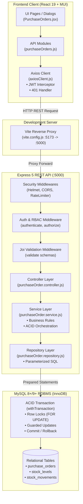

# Retail Inventory Management System (RIMS) — Viva & Technical Overview

This comprehensive document is designed for students, examiners, and software engineers to explain and understand the architectural design, database modeling, request lifecycles, concurrency controls, security mechanisms, and frontend engineering of the **Retail Inventory Management System (RIMS / MyGodown)**.

---

## 1. Executive Summary & System Purpose

The **Retail Inventory Management System (RIMS)** is a production-grade, multi-facility inventory and warehouse logistics management platform built to give enterprise retail businesses complete operational control and auditability over their physical goods. The system solves the real-world operational challenges of retail warehousing: stock discrepancy between physical shelves and software records, accidental overselling, unauthorized inventory adjustments, lack of supplier procurement tracking, and data leakages of sensitive financial margins to warehouse staff.

RIMS serves three distinct operational personas via strict Role-Based Access Control (RBAC):
1. **Administrators:** Full system authority. Manages users, resets passwords, views aggregate financial valuations, configures warehouses, catalogs products, and approves purchase/sales workflows.
2. **Warehouse Managers:** Operational authority. Creates and approves purchase orders, oversees stock counts, authorizes inter-warehouse inventory transfers, and manages sales order fulfillment.
3. **Inventory Staff:** Floor-level execution. View catalog items and stock availability, initiates sales orders, confirms and fulfills customer shipments, while being strictly masked from unit cost prices and aggregate stock valuations.

The system is implemented as a decoupled, full-stack application comprising a **React 19 / Material-UI (MUI)** Single Page Application (SPA), a **Node.js / Express 5** RESTful API backend, and an **ACID-compliant MySQL 8+ / 9+** relational database.

---

## 2. End-to-End Architecture

### 2.1 Text Architectural Diagram

```
[ BROWSER CLIENT ]
  │
  ├─ React UI Pages & Components (MUI v9 DataGrid, Dialogs, Charts)
  │    └─ State Management (React Context: AuthContext, UI Hooks)
  │
  ├─ Frontend API Client Modules (src/api/purchaseOrders.js, etc.)
  │    └─ Axios HTTP Instance (src/api/axiosClient.js)
  │         ├─ Request Interceptor: Injects Authorization Bearer JWT
  │         └─ Response Interceptor: Unwraps JSON envelope & handles 401 expiry
  │
  ▼ HTTP localhost:5173/api/*
[ VITE DEVELOPMENT SERVER / REVERSE PROXY ] (vite.config.js)
  │
  ▼ Reverse Proxy Forwarding (http://localhost:5000/api/*)
[ EXPRESS 5 REST API BACKEND ]
  │
  ├─ Global Pre-routing Middlewares
  │    ├─ Helmet (HTTP security headers)
  │    ├─ CORS (Cross-Origin Resource Sharing)
  │    ├─ express.json() (JSON body parser)
  │    └─ express-rate-limit (Brute-force protection on /auth/login)
  │
  ├─ Route Handlers (src/routes/*.routes.js)
  │    ├─ authenticate (src/middleware/auth.js: JWT verification & user active check)
  │    ├─ authorize (src/middleware/auth.js: RBAC role verification)
  │    └─ validate (src/middleware/validate.js: Joi schema validation)
  │
  ├─ Controllers (src/controllers/*.controller.js)
  │    └─ asyncHandler (Extracts params/body, delegates to Service, invokes sendSuccess/sendError)
  │
  ├─ Services (src/services/*.service.js)
  │    └─ Business Logic, Invariants, State Machines, withTransaction wrapper orchestration
  │
  ├─ Repositories (src/repositories/*.repository.js)
  │    └─ Pure SQL prepared statements (mysql2/promise pool.execute / conn.execute)
  │
  ▼ TCP / MySQL Protocol (Port 3306)
[ MYSQL RELATIONAL DATABASE (InnoDB) ]
  └─ Tables: users, warehouses, suppliers, products, stock_levels, stock_movements,
             purchase_orders, purchase_order_items, sales_orders, sales_order_items
```

### 2.2 Mermaid Architecture Diagram



### 2.3 Layer Responsibilities & Separation of Concerns

1. **Pages / Components (`frontend/src/pages/`):** Responsible solely for rendering presentation, managing user inputs, and local component states. Never constructs raw SQL or performs business calculations.
2. **API Client Modules (`frontend/src/api/`):** Isolates backend URL structure from UI components. If an endpoint changes, only the API module needs updating.
3. **Axios Client Interceptors (`frontend/src/api/axiosClient.js`):** Centralizes cross-cutting concerns: auto-injecting the JWT Bearer token into outgoing headers and catching HTTP 401 Unauthorized errors to automatically redirect expired sessions to `/login`.
4. **Vite Proxy (`frontend/vite.config.js`):** In local development, eliminates CORS issues by forwarding `/api/*` requests from browser port 5173 to backend port 5000.
5. **Express Middlewares (`backend/src/middleware/`):**
   - `authenticate`: Validates JWT signature, expiration, and ensures user has not been deactivated in the database.
   - `authorize`: Enforces role boundaries before any business logic executes.
   - `validate`: Sanitizes and validates request body, query, and params using Joi schemas (`stripUnknown: true`), stopping malformed requests at the boundary.
6. **Controllers (`backend/src/controllers/`):** HTTP layer adapter. Parses HTTP inputs, calls the appropriate service method, and formats the response using standardized JSON envelopes (`sendSuccess`, `sendError`).
7. **Services (`backend/src/services/`):** The core business domain. Enforces business rules (e.g. stock non-negativity, status transitions, role-based column omissions) and coordinates multi-repository ACID transactions.
8. **Repositories (`backend/src/repositories/`):** Data access layer. Contains parameterized SQL statements. Contains zero business rules and zero HTTP awareness.
9. **MySQL Database:** Authoritative source of truth. Enforces physical relational constraints, referential integrity (`FOREIGN KEY ... ON DELETE RESTRICT`), data type consistency, and InnoDB row-level locking.

---

## 3. Database Design & Relational Constraints

The database schema comprises **10 normalized tables** built on the **InnoDB** storage engine with `utf8mb4_unicode_ci` collation.

### 3.1 Schema Table Summary

| Table | Purpose | Key Constraints |
|---|---|---|
| `users` | System actors and authentication credentials | `email` UNIQUE; `role` ENUM('admin','manager','staff'); `is_active` soft-delete flag. |
| `warehouses` | Physical storage sites | `code` UNIQUE (e.g., 'WH-CENTRAL'); `is_active` soft-delete flag. |
| `suppliers` | External vendors for procurement | `name` indexed; `is_active` soft-delete flag. |
| `products` | Master sellable catalog items | `sku` UNIQUE; `supplier_id` FK RESTRICT; `unit_price`, `cost_price`, `reorder_level` DECIMAL/INT CHECK >= 0; `is_active` soft-delete. |
| `stock_levels` | Real-time on-hand stock per product per warehouse | UNIQUE(`product_id`, `warehouse_id`); `quantity` INT CHECK >= 0; FK RESTRICT on product & warehouse. |
| `stock_movements` | Immutable audit ledger of all stock changes | `movement_type` ENUM('in', 'out', 'adjustment'); `reference_type` ('purchase_order', 'sales_order', 'adjustment', 'transfer'); FK RESTRICT; append-only (no `updated_at`). |
| `purchase_orders` | Inbound procurement orders | `po_number` UNIQUE; `status` ENUM('draft', 'ordered', 'received', 'cancelled'); `total_amount` DECIMAL(10,2) CHECK >= 0; FK RESTRICT. |
| `purchase_order_items` | Line items for purchase orders | UNIQUE(`purchase_order_id`, `product_id`); `quantity` INT CHECK > 0; `unit_cost` DECIMAL(10,2) CHECK >= 0; FK RESTRICT. |
| `sales_orders` | Outbound customer sales orders | `so_number` UNIQUE; `status` ENUM('draft', 'confirmed', 'fulfilled', 'cancelled'); `total_amount` DECIMAL(10,2) CHECK >= 0; FK RESTRICT. |
| `sales_order_items` | Line items for sales orders | UNIQUE(`sales_order_id`, `product_id`); `quantity` INT CHECK > 0; `unit_price` DECIMAL(10,2) CHECK >= 0; FK RESTRICT. |

### 3.2 Core Database Constraints & Why They Matter

1. **`UNIQUE` Constraints:**
   - Enforced on `users.email`, `warehouses.code`, `products.sku`, `purchase_orders.po_number`, and `sales_orders.so_number`.
   - Composite unique constraints on `stock_levels(product_id, warehouse_id)`, `purchase_order_items(purchase_order_id, product_id)`, and `sales_order_items(sales_order_id, product_id)`.
   - *Why:* Guarantees data integrity at the storage engine level, preventing duplicate SKUs or multiple conflicting inventory records for the same product in a single warehouse.
2. **`FOREIGN KEY` with `ON DELETE RESTRICT`:**
   - Every relation between transactions (orders, movements, stock) and master entities (products, warehouses, suppliers, users) uses `ON DELETE RESTRICT`.
   - *Why:* Prevents orphaned records. A warehouse or product with transaction history cannot be abruptly deleted, protecting historical audit trails from corruption.
3. **`CHECK` Constraints (`quantity >= 0`, `unit_price >= 0`):**
   - Active in MySQL 8.0.16+.
   - *Why:* Provides an impenetrable safety guard. Even if an application bug bypassed software checks, the MySQL engine rejects any query that would cause `stock_levels.quantity` or product prices to drop below zero.
4. **`DECIMAL(10, 2)` for Monetary Values:**
   - Used for `unit_price`, `cost_price`, `unit_cost`, and `total_amount`.
   - *Why:* Standard IEEE 754 floating-point numbers (`FLOAT` or `DOUBLE`) suffer from binary rounding errors (e.g. `0.1 + 0.2 = 0.30000000000000004`). `DECIMAL` stores exact fixed-point base-10 numbers, essential for financial and accounting accuracy.
5. **Soft Deletion (`is_active TINYINT(1)`):**
   - Master entities (`users`, `warehouses`, `suppliers`, `products`) are deactivated rather than physically removed (`UPDATE ... SET is_active = 0`).
   - *Why:* Deactivated items cannot be selected for new purchase or sales orders, but existing historical orders, stock ledger entries, and audit reports remain 100% intact.

---

## 4. End-to-End Request Trace Line-by-Line: "Receive Purchase Order"

To demonstrate the full lifecycle of a transaction through every architectural layer, we trace **UC-27: Receive Purchase Order** (`POST /api/purchase-orders/:id/receive`).

### Step 1: User Triggers the Action in the UI
- **File:** [`frontend/src/pages/PurchaseOrders.jsx`](file:///C:/Users/prtv1/OneDrive/Attachments/Desktop/HCL%20Tech/frontend/src/pages/PurchaseOrders.jsx#L438-L452)
- In the DataGrid action column, if the order status is `'ordered'` and user has manager/admin permissions (`canManage`), the green Checkmark icon button is rendered:
```jsx
// frontend/src/pages/PurchaseOrders.jsx (lines 438-452)
{canManage && po.status === 'ordered' && (
  <Tooltip title="Receive Goods into Inventory (UC-27)">
    <IconButton
      size="small"
      color="success"
      onClick={() => {
        setReceiveTargetId(po.id);
        setReceiveError(null);
        setReceiveConfirmOpen(true);
      }}
    >
      <CheckCircleOutlinedIcon fontSize="small" />
    </IconButton>
  </Tooltip>
)}
```
- Clicking the button opens the `<ConfirmDialog>` component (lines 928-942), displaying a confirmation warning that receiving goods adds physical stock and cannot be undone.

### Step 2: Confirm Dialog Executes the API Handler
- **File:** [`frontend/src/pages/PurchaseOrders.jsx`](file:///C:/Users/prtv1/OneDrive/Attachments/Desktop/HCL%20Tech/frontend/src/pages/PurchaseOrders.jsx#L319-L335)
- Clicking "Confirm Receipt & Restock" invokes `handleConfirmReceive`:
```javascript
// frontend/src/pages/PurchaseOrders.jsx (lines 319-335)
const handleConfirmReceive = async () => {
  if (!receiveTargetId) return;
  setReceiveLoading(true);
  setReceiveError(null);
  try {
    await purchaseOrdersApi.receive(receiveTargetId);
    setReceiveConfirmOpen(false);
    fetchPurchaseOrders();
    if (detailOpen && selectedPO?.id === receiveTargetId) {
      handleOpenDetail(receiveTargetId);
    }
  } catch (err) {
    setReceiveError(err);
  } finally {
    setReceiveLoading(false);
  }
};
```

### Step 3: Frontend API Client Invocation
- **File:** [`frontend/src/api/purchaseOrders.js`](file:///C:/Users/prtv1/OneDrive/Attachments/Desktop/HCL%20Tech/frontend/src/api/purchaseOrders.js#L30-L33)
- The method dispatches an HTTP POST via the configured Axios client:
```javascript
// frontend/src/api/purchaseOrders.js (lines 30-33)
/**
 * UC-27: Receive purchase order goods into warehouse stock
 */
receive: (id) => axiosClient.post(`/purchase-orders/${id}/receive`),
```

### Step 4: Axios Request Interceptor Injects Authentication
- **File:** [`frontend/src/api/axiosClient.js`](file:///C:/Users/prtv1/OneDrive/Attachments/Desktop/HCL%20Tech/frontend/src/api/axiosClient.js#L15-L30)
- The interceptor fetches the JWT token stored in browser `localStorage` and appends the standard Bearer header:
```javascript
// frontend/src/api/axiosClient.js (lines 16-28)
axiosClient.interceptors.request.use(
  (config) => {
    try {
      const token = localStorage.getItem(STORAGE_KEYS.TOKEN);
      if (token) {
        config.headers.Authorization = `Bearer ${token}`;
      }
    } catch (err) {
      console.error('[axiosClient] Unable to retrieve auth token from localStorage', err);
    }
    return config;
  },
  (error) => Promise.reject(error)
);
```

### Step 5: Vite Reverse Proxy Forwards the Request
- **File:** [`frontend/vite.config.js`](file:///C:/Users/prtv1/OneDrive/Attachments/Desktop/HCL%20Tech/frontend/vite.config.js#L9-L15)
- The browser dispatches to `http://localhost:5173/api/purchase-orders/1/receive`. Vite matches the `/api` prefix and transparently proxies the request to the Node.js backend:
```javascript
// frontend/vite.config.js (lines 9-15)
proxy: {
  '/api': {
    target: 'http://localhost:5000',
    changeOrigin: true,
    secure: false,
  },
},
```

### Step 6: Express Routing & Middleware Pipeline
- **File:** [`backend/src/routes/purchaseOrder.routes.js`](file:///C:/Users/prtv1/OneDrive/Attachments/Desktop/HCL%20Tech/backend/src/routes/purchaseOrder.routes.js#L24-L68)
- The request hits the router pipeline:
```javascript
// backend/src/routes/purchaseOrder.routes.js (lines 25-26, 64-68)
router.use(authenticate);
router.use(authorize(ROLES.ADMIN, ROLES.MANAGER));

// UC-27: Receive Purchase Order
router.post(
  '/:id/receive',
  validate(poIdParamSchema, 'params'),
  purchaseOrderController.receive
);
```
1. **`authenticate` ([`backend/src/middleware/auth.js:18-69`](file:///C:/Users/prtv1/OneDrive/Attachments/Desktop/HCL%20Tech/backend/src/middleware/auth.js#L18-L69)):** Decodes `Authorization: Bearer <token>`, verifies signature with `JWT_SECRET`, checks database to ensure user is active (`is_active = 1`), and attaches `req.user`.
2. **`authorize` ([`backend/src/middleware/auth.js:76-88`](file:///C:/Users/prtv1/OneDrive/Attachments/Desktop/HCL%20Tech/backend/src/middleware/auth.js#L76-L88)):** Verifies `['admin', 'manager'].includes(req.user.role)`. If `staff` attempts this call, immediate `403 Forbidden` is returned.
3. **`validate` ([`backend/src/middleware/validate.js:17-63`](file:///C:/Users/prtv1/OneDrive/Attachments/Desktop/HCL%20Tech/backend/src/middleware/validate.js#L17-L63)):** Runs Joi schema `poIdParamSchema` against `req.params.id`. Verifies it is a positive integer.

### Step 7: Controller Invocation
- **File:** [`backend/src/controllers/purchaseOrder.controller.js`](file:///C:/Users/prtv1/OneDrive/Attachments/Desktop/HCL%20Tech/backend/src/controllers/purchaseOrder.controller.js#L101-L104)
- The controller extracts parameters and delegates execution to the service layer:
```javascript
// backend/src/controllers/purchaseOrder.controller.js (lines 101-104)
receive = asyncHandler(async (req, res) => {
  const po = await purchaseOrderService.receivePurchaseOrder(req.params.id, req.user.id);
  return sendSuccess(res, po, 200);
});
```

### Step 8: Service Layer ACID Transaction & Concurrency Guards
- **File:** [`backend/src/services/purchaseOrder.service.js`](file:///C:/Users/prtv1/OneDrive/Attachments/Desktop/HCL%20Tech/backend/src/services/purchaseOrder.service.js#L442-L500)
- Execution enters `withTransaction(async (conn) => ...)` ([`backend/src/config/db.js:66-79`](file:///C:/Users/prtv1/OneDrive/Attachments/Desktop/HCL%20Tech/backend/src/config/db.js#L66-L79)):
```javascript
// backend/src/services/purchaseOrder.service.js (lines 448-499)
return withTransaction(async (conn) => {
  // 1. Acquire pessimistic lock on the PO row
  const po = await purchaseOrderRepository.lockPoForUpdate(conn, poId);
  if (!po) {
    throw new NotFoundError(`Purchase order with ID ${poId} not found`);
  }

  // 2. State verification
  if (po.status === 'draft') throw new ConflictError('Cannot receive draft PO; must be ordered first');
  if (po.status === 'received') throw new ConflictError('Purchase order has already been received');
  if (po.status === 'cancelled') throw new ConflictError('Cannot receive a cancelled purchase order');
  if (po.status !== 'ordered') throw new ConflictError(`Purchase order cannot be received in status '${po.status}'`);

  // 3. Guarded UPDATE BEFORE calling inventory service (critical concurrency guard)
  const affectedRows = await purchaseOrderRepository.guardedUpdateStatusToReceived(conn, {
    id: poId,
    receivedBy: userId,
  });

  if (affectedRows !== 1) {
    throw new ConflictError('Purchase order has already been received or cancelled');
  }

  // 4. Fetch line items
  const items = await purchaseOrderRepository.findItemsByPoId(poId, conn);

  // 5. Invoke inventory service for each line item to increment stock & write ledger
  for (const item of items) {
    await inventoryService.addStockFromPurchaseOrder(conn, {
      productId: item.productId,
      warehouseId: po.warehouseId,
      quantity: item.quantity,
      userId,
      poId: po.id,
      poNumber: po.poNumber,
    });
  }

  // 6. Return refreshed PO representation
  return purchaseOrderRepository.findById(poId, conn);
});
```

### Step 9: Database Execution Inside Repository & Inventory Service
1. **Lock Row:** [`purchaseOrderRepository.lockPoForUpdate`](file:///C:/Users/prtv1/OneDrive/Attachments/Desktop/HCL%20Tech/backend/src/repositories/purchaseOrder.repository.js#L211-L223) executes:
   ```sql
   SELECT id, po_number AS poNumber, supplier_id AS supplierId, warehouse_id AS warehouseId,
          status, total_amount AS totalAmount, notes, created_by AS createdBy
   FROM purchase_orders WHERE id = ? FOR UPDATE;
   ```
2. **Guarded State Transition:** [`purchaseOrderRepository.guardedUpdateStatusToReceived`](file:///C:/Users/prtv1/OneDrive/Attachments/Desktop/HCL%20Tech/backend/src/repositories/purchaseOrder.repository.js#L232-L240) executes:
   ```sql
   UPDATE purchase_orders 
   SET status = 'received', received_at = CURRENT_TIMESTAMP, received_by = ? 
   WHERE id = ? AND status = 'ordered';
   ```
   *Crucial Guard:* If another parallel thread updated the status a millisecond earlier, `affectedRows` is 0. The service throws `ConflictError(409)` immediately, guaranteeing inventory is never touched twice.
3. **Inventory Increment:** [`inventoryService.addStockFromPurchaseOrder`](file:///C:/Users/prtv1/OneDrive/Attachments/Desktop/HCL%20Tech/backend/src/services/inventory.service.js#L351-L385) executes:
   - Locks `stock_levels` row `FOR UPDATE`.
   - Upserts new balance: `INSERT INTO stock_levels (product_id, warehouse_id, quantity) VALUES (?, ?, ?) ON DUPLICATE KEY UPDATE quantity = ?;`
   - Inserts immutable ledger entry into `stock_movements`:
     ```sql
     INSERT INTO stock_movements (product_id, warehouse_id, user_id, movement_type, reference_type, reference_id, quantity, reference)
     VALUES (?, ?, ?, 'in', 'purchase_order', ?, ?, 'PO Receipt: PO-...');
     ```
4. **Transaction Commit:** `withTransaction` calls `await connection.commit()`. The connection is returned to the pool (`connection.release()`).

### Step 10: Response Processing & UI Update
1. Controller returns HTTP 200 with standard envelope:
   ```json
   {
     "success": true,
     "data": { "id": 1, "poNumber": "PO-2026-0001", "status": "received", "receivedAt": "..." }
   }
   ```
2. Axios response interceptor ([`frontend/src/api/axiosClient.js:33-37`](file:///C:/Users/prtv1/OneDrive/Attachments/Desktop/HCL%20Tech/frontend/src/api/axiosClient.js#L33-L37)) unwraps `response.data`.
3. In `handleConfirmReceive`, `setReceiveConfirmOpen(false)` closes the modal, `fetchPurchaseOrders()` reloads the latest DataGrid records, and the order badge updates to `'received'`. The Receive button vanishes, completely preventing double receipt.

---

## 5. Critical Business Rules & Enforcement Points

| Business Rule | Description & Failure Mode | Backend Enforcement Location | Frontend UI Mirror Location |
|---|---|---|---|
| **Negative Stock Prevention (BR-02)** | Stock level must never drop below 0. Overselling or deducting more than available stock returns `422 Unprocessable Entity`. | 1. DB CHECK constraint `chk_stock_levels_quantity CHECK (quantity >= 0)` in [`database/schema.sql:136`](file:///C:/Users/prtv1/OneDrive/Attachments/Desktop/HCL%20Tech/database/schema.sql#L136)<br>2. Service check `inventoryService.deductStockForSalesOrder` in [`backend/src/services/inventory.service.js:409-413`](file:///C:/Users/prtv1/OneDrive/Attachments/Desktop/HCL%20Tech/backend/src/services/inventory.service.js#L409-L413) | `StockAdjustmentDialog.jsx` and `TransferDialog.jsx` validate max quantities client-side before sending. |
| **Double Receive Prevention (BR-07)** | A purchase order cannot be received more than once. Subsequent attempts return `409 Conflict` and leave stock unchanged. | 1. `purchaseOrderService.receivePurchaseOrder` state check in [`backend/src/services/purchaseOrder.service.js:459-461`](file:///C:/Users/prtv1/OneDrive/Attachments/Desktop/HCL%20Tech/backend/src/services/purchaseOrder.service.js#L459-L461)<br>2. SQL Guarded UPDATE in [`backend/src/repositories/purchaseOrder.repository.js:232-240`](file:///C:/Users/prtv1/OneDrive/Attachments/Desktop/HCL%20Tech/backend/src/repositories/purchaseOrder.repository.js#L232-L240) | Receive button conditionally rendered **only** when `po.status === 'ordered'` in [`PurchaseOrders.jsx:438-452`](file:///C:/Users/prtv1/OneDrive/Attachments/Desktop/HCL%20Tech/frontend/src/pages/PurchaseOrders.jsx#L438-L452). |
| **Double Fulfil Prevention (BR-08)** | A sales order cannot be fulfilled more than once. Subsequent attempts return `409 Conflict` and leave stock unchanged. | 1. `salesOrderService.fulfillSalesOrder` state check in [`backend/src/services/salesOrder.service.js:410-415`](file:///C:/Users/prtv1/OneDrive/Attachments/Desktop/HCL%20Tech/backend/src/services/salesOrder.service.js#L410-L415)<br>2. SQL Guarded UPDATE `WHERE id = ? AND status = 'confirmed'` in [`backend/src/repositories/salesOrder.repository.js:230-240`](file:///C:/Users/prtv1/OneDrive/Attachments/Desktop/HCL%20Tech/backend/src/repositories/salesOrder.repository.js#L230-L240) | Fulfil button conditionally rendered **only** when `so.status === 'confirmed'` in `SalesOrders.jsx`. |
| **Shortage Atomic Rollback (BR-08)** | If fulfilling a multi-item order encounters insufficient stock on item N, items 1 to N-1 must NOT remain deducted. | Handled by `withTransaction` in [`backend/src/config/db.js:66-79`](file:///C:/Users/prtv1/OneDrive/Attachments/Desktop/HCL%20Tech/backend/src/config/db.js#L66-L79). When `InsufficientStockError` is thrown, `connection.rollback()` reverts all previous deductions. | Error alert displays backend rejection reason without mutating local DataGrid stock counts. |
| **Deadlock-Free Atomic Transfer (BR-03)** | Transferring stock between warehouses must be atomic, prevent negative source stock, and avoid database deadlocks. | 1. Sorted lock acquisition (`Math.min(srcId, dstId)` then `Math.max(srcId, dstId)`) in [`backend/src/services/inventory.service.js:260-275`](file:///C:/Users/prtv1/OneDrive/Attachments/Desktop/HCL%20Tech/backend/src/services/inventory.service.js#L260-L275)<br>2. Linked stock movements sharing unique transfer reference. | `TransferDialog.jsx` prevents selecting identical source and destination warehouses. |
| **Staff Margin Masking (BR-05)** | Inventory staff must NEVER see product cost prices or aggregate inventory valuations. | Sanitized at repository/service boundary via `omitCostPrice` in [`backend/src/services/product.service.js`](file:///C:/Users/prtv1/OneDrive/Attachments/Desktop/HCL%20Tech/backend/src/services/product.service.js) and [`dashboard.service.js`](file:///C:/Users/prtv1/OneDrive/Attachments/Desktop/HCL%20Tech/backend/src/services/dashboard.service.js). Sensitive keys are omitted from JSON payload. | MUI DataGrid cost columns and total value KPI cards conditionally unmounted using `hasRole(['admin', 'manager'])` in `permissions.js`. |
| **Last Active Admin Guard** | The system must prevent deactivating or demoting the final remaining active administrator account. | Explicit count query `SELECT COUNT(*) FROM users WHERE role = 'admin' AND is_active = 1` in [`backend/src/services/user.service.js`](file:///C:/Users/prtv1/OneDrive/Attachments/Desktop/HCL%20Tech/backend/src/services/user.service.js). Throws `ConflictError(409)`. | `Users.jsx` deactivation switch disabled with tooltip if user is the sole remaining admin. |

---

## 6. Security Summary & Implementation

1. **Password Hashing:** Implemented with `bcryptjs` using 10 salt rounds (`backend/src/services/auth.service.js`). Plaintext passwords are never persisted to disk or output in server logs.
2. **Stateless JWT Authentication:**
   - Tokens signed with HMAC SHA-256 (`jsonwebtoken`), carrying user ID, email, and role.
   - Configurable token expiration (`JWT_EXPIRES_IN=8h`).
   - Every protected route re-validates the user's active status against MySQL to instantly revoke access if an employee is deactivated.
3. **Strict Request Validation (Joi):**
   - Every route parameter, query parameter, and JSON body is checked against schema validators ([`backend/src/validators/`](file:///C:/Users/prtv1/OneDrive/Attachments/Desktop/HCL%20Tech/backend/src/validators/)).
   - `stripUnknown: true` strips unexpected payload properties, eliminating mass-assignment vulnerabilities.
   - `abortEarly: false` aggregates all validation failures into a structured 400 response.
4. **Parameterized SQL (Anti-SQL Injection):**
   - 100% of database queries execute through `mysql2/promise` prepared statements with `?` parameter placeholders. Zero string concatenation is permitted in SQL queries.
5. **Dual-Layer RBAC (Defense in Depth):**
   - **Backend:** `authorize(...roles)` middleware blocks unauthorized API calls with `403 Forbidden`.
   - **Frontend:** `ProtectedRoute.jsx` redirects unauthorized URL navigation to `/access-denied`, while UI components selectively hide buttons and columns using `permissions.js`.
6. **HTTP Security Headers (Helmet):** Configures CSP, X-Frame-Options (anti-clickjacking), X-Content-Type-Options (anti-MIME sniffing), and Referrer-Policy.
7. **Brute Force Rate Limiting:** `express-rate-limit` enforces a strict threshold (10 requests per 15 minutes per IP) on `/api/auth/login`.
8. **Sensitive Field Omission:** Password hashes (`password_hash`) are explicitly excluded from user queries and response serializers.

---

## 7. Comprehensive Technical Glossary

- **JWT (JSON Web Token):** A compact, URL-safe means of representing claims securely between two parties. Composed of Header, Payload, and Signature, signed using a secret server key.
- **Middleware:** A composable software function in Express that intercepts an incoming HTTP request before it reaches the final controller handler, performing tasks like authentication, logging, or payload validation.
- **ACID Transaction:** A database transaction satisfying four guarantees: **Atomicity** (all operations succeed or all are rolled back), **Consistency** (state transitions respect all schema constraints), **Isolation** (concurrent transactions do not interfere), and **Durability** (committed changes survive system crashes).
- **Row Lock (`SELECT ... FOR UPDATE`):** A pessimistic concurrency control mechanism in MySQL InnoDB that locks specific database rows against concurrent writes or reads by other transactions until the current transaction commits or rolls back.
- **Idempotence:** An API operation property where executing the request multiple times produces the identical side-effect as executing it once. (e.g. attempting to receive an already received PO returns 409 and does not alter stock).
- **Soft Delete:** A data design pattern where records are flagged as inactive (`is_active = 0`) instead of being permanently removed via SQL `DELETE`, preserving foreign-key referential integrity and audit histories.
- **SKU (Stock Keeping Unit):** A unique alphanumeric code identifying a specific product variant across the supply chain.
- **Reorder Level:** The threshold quantity of stock below which replenishment is triggered to prevent stockouts.
- **`DECIMAL(10, 2)`:** A fixed-point numeric SQL data type storing exact decimal representations (10 total digits, 2 after decimal point), eliminating binary floating-point approximation errors in financial amounts.
- **`CHECK` Constraint:** A relational database constraint that enforces a boolean condition on row values (e.g. `quantity >= 0`), actively enforced in MySQL 8.0.16+.
- **Foreign Key (`ON DELETE RESTRICT`):** A database constraint linking child rows to parent rows, where `RESTRICT` prevents deleting the parent record if any child record references it.
- **Response Envelope:** A standardized JSON wrapper structure (e.g. `{ "success": true, "data": { ... }, "meta": { ... } }`) ensuring uniform client-side consumption across all API endpoints.
- **Reverse Proxy:** An intermediary server (such as Vite dev server or Nginx) that intercepts client requests and forwards them to backend services, avoiding cross-origin (CORS) complications.
- **Code-Splitting / Lazy Loading:** An optimization technique where application JavaScript bundles are divided into smaller chunks loaded on demand when the user navigates to a specific route, minimizing initial page load time.
- **Vendor Chunk:** A separate compiled bundle containing third-party libraries (e.g., React, Material-UI, Recharts) that rarely change, allowing browsers to aggressively cache them across application deployments.

---

## 8. Top 10 Viva Examination Questions & Model Answers

### Q1: Why did you choose a three-tier architecture (Controller-Service-Repository) instead of putting SQL queries directly in route handlers?
**Answer:** The three-tier architecture separates concerns cleanly:
- **Controllers** handle HTTP transport details (status codes, headers, parameter parsing).
- **Services** encapsulate the business logic, transaction boundaries (`withTransaction`), and state machine transitions.
- **Repositories** manage database persistence via parameterized SQL.
This decoupling makes the codebase testable (we can unit-test business logic without mocking HTTP or database engines), maintainable, and ensures business rules (like stock deduction or RBAC masking) cannot be bypassed by different controllers.

### Q2: How does the system prevent the "Double Receive" problem if two warehouse managers click "Receive" simultaneously on the same Purchase Order?
**Answer:** We implement dual-layer concurrency control:
1. **Pessimistic Row Locking:** Inside an ACID transaction (`withTransaction`), we execute `SELECT ... FOR UPDATE` on the purchase order row. The second transaction must block until the first finishes.
2. **Guarded State Transition:** We execute `UPDATE purchase_orders SET status = 'received' ... WHERE id = ? AND status = 'ordered'`.
Even if two concurrent requests bypassed initial checks, the second request matches zero rows (`affectedRows === 0`), causing the service layer to abort immediately with a `409 Conflict` before calling the inventory service. Stock is guaranteed to be incremented exactly once.

### Q3: Why is `DECIMAL(10,2)` used for financial amounts instead of `FLOAT` or `DOUBLE`?
**Answer:** `FLOAT` and `DOUBLE` use binary IEEE 754 floating-point representations, which cannot precisely represent fractional base-10 decimals like `0.10` or `0.01`, leading to cumulative rounding errors (e.g., `0.1 + 0.2 = 0.30000000000000004`). `DECIMAL(10,2)` stores numbers as exact fixed-point values in binary-coded decimal, guaranteeing mathematical precision required for procurement costs, sales totals, and inventory valuations.

### Q4: How does the frontend handle token expiration and unauthorized access?
**Answer:** Through a combination of Axios response interceptors and React Router route guards:
- **Axios Interceptor (`axiosClient.js`):** Listens for HTTP `401 Unauthorized` responses. Upon receiving a 401, it purges `localStorage`, dispatches a `rims:session-expired` event, and redirects the browser to `/login?expired=1`.
- **`ProtectedRoute.jsx`:** Inspects the authenticated user's role before rendering any route. If an unauthenticated user visits a private URL, they are redirected to `/login`; if a staff user enters `/purchase-orders`, they are redirected to `/access-denied`.

### Q5: What happens if a sales order contains 3 items, and item 3 has insufficient stock during fulfillment?
**Answer:** The entire fulfillment operation is wrapped in an ACID transaction using `withTransaction`. When the loop attempts to fulfill item 3, `inventoryService.deductStockForSalesOrder` detects that available stock is less than required and throws an `InsufficientStockError (422)`. The catch block executes `await connection.rollback()`, which reverts all database updates—including stock deductions for items 1 and 2 and the status change on the sales order. The database returns to its exact pre-request state.

### Q6: Why did you implement soft deletion (`is_active = 0`) instead of physical SQL `DELETE`?
**Answer:** Master records like products, warehouses, and suppliers are referenced across historical transactions (`stock_movements`, `purchase_orders`, `sales_orders`). Physical deletion would either fail due to `FOREIGN KEY ... ON DELETE RESTRICT` constraints, or if cascaded, would destroy historical audit logs and corrupt financial accounting records. Soft deletion deactivates items from future order selection while preserving complete historical integrity.

### Q7: How is staff data masking (BR-05) enforced to prevent inventory staff from inspecting margins?
**Answer:** Enforcement is applied at the backend service layer:
- In `product.service.js`, `inventory.service.js`, and `dashboard.service.js`, when `req.user.role === 'staff'`, sensitive properties (`costPrice`, `stockValue`, and financial valuation cards) are deleted from the returned payload before the HTTP response is sent.
- Even if a staff member inspects the browser DevTools Network tab, the sensitive keys are completely absent from the JSON payload.
- On the frontend, `permissions.js` unmounts cost columns from MUI DataGrid and hides total value KPI summary cards.

### Q8: What prevents deadlocks during inter-warehouse stock transfers?
**Answer:** Deadlocks occur when Transaction A locks Warehouse 1 and waits for Warehouse 2, while concurrent Transaction B locks Warehouse 2 and waits for Warehouse 1. We prevent this in `inventoryService.transferStock` by always sorting warehouse IDs in ascending order (`Math.min(srcId, dstId)` followed by `Math.max(srcId, dstId)`) before acquiring row locks. Because all concurrent transfer transactions acquire locks in the identical deterministic sequence, circular wait conditions are impossible.

### Q9: How is Vite configured to avoid Cross-Origin Resource Sharing (CORS) errors during development?
**Answer:** In `vite.config.js`, a development reverse proxy is configured:
```javascript
server: {
  proxy: {
    '/api': {
      target: 'http://localhost:5000',
      changeOrigin: true,
      secure: false
    }
  }
}
```
The browser sends requests to `http://localhost:5173/api/...` (the same origin as the frontend). The Vite development server forwards the request over the local loopback network to the backend at port 5000, receives the response, and returns it to the browser. This eliminates CORS preflight restrictions in development while mimicking a production reverse-proxy architecture (like Nginx).

### Q10: Why are database migrations designed to be strictly additive and idempotent?
**Answer:** Production databases must be updatable without data loss or downtime:
- **Additive:** We use `CREATE TABLE IF NOT EXISTS` and check column existence in `information_schema.columns` before executing `ALTER TABLE ADD COLUMN`. We never execute `DROP` or `TRUNCATE`.
- **Idempotent:** Running migration scripts multiple times produces the exact same schema state without throwing errors or creating duplicate structures. This guarantees continuous integration safety and predictable environment provisioning.
